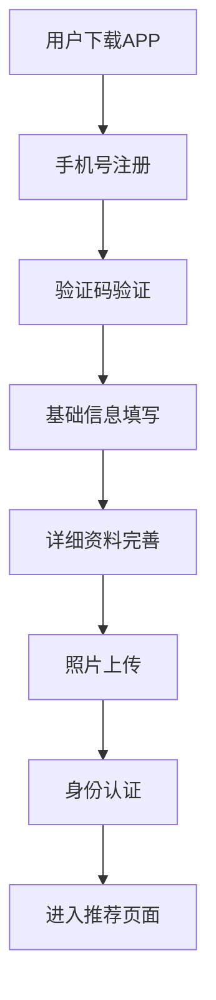
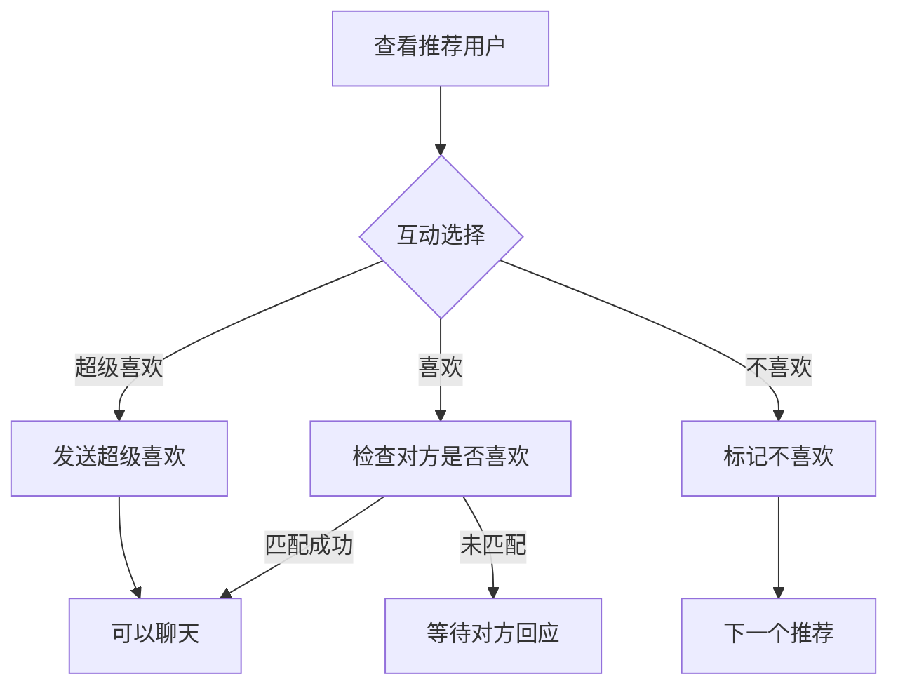
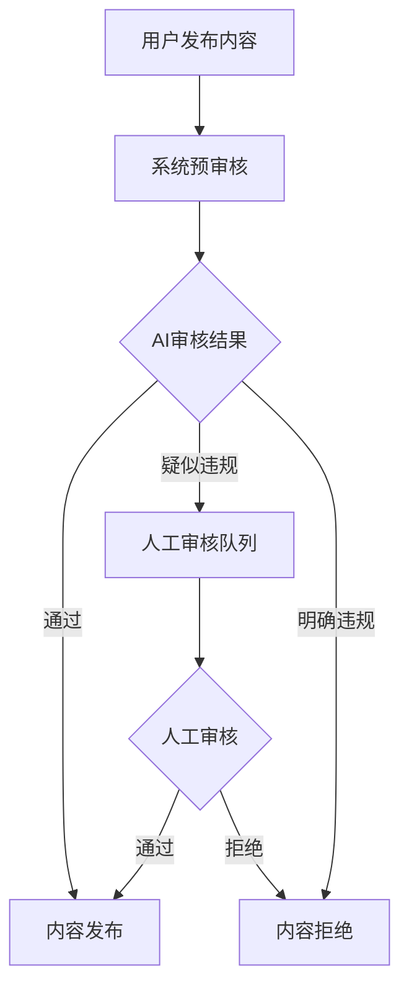

# Amoure Dating Application - API 全面分析文档

## 项目概述

Amoure是一个现代化的交友约会应用，提供用户注册认证、个人资料管理、智能推荐匹配、即时消息聊天、动态发布、VIP会员等核心功能。该项目采用Spring Boot微服务架构，分为客户端API（amoure-app）和管理后台API（amoure-manager）两个主要模块。

### 技术栈
- **后端框架**: Spring Boot 2.x
- **数据库**: PostgreSQL + MyBatis Plus
- **认证授权**: Sa-Token
- **缓存**: Redis
- **消息队列**: RocketMQ
- **文件存储**: OSS
- **即时通讯**: 腾讯IM
- **支付**: Apple Pay, 微信支付等

## 系统架构

```
┌─────────────────────────────────────────────────────────┐
│                   Amoure Dating Platform                │
├─────────────────────────────────────────────────────────┤
│  amoure-app (客户端API)    │  amoure-manager (管理后台)   │
│  ├─ 用户认证与注册          │  ├─ 用户管理                │
│  ├─ 个人资料管理           │  ├─ 内容审核                │
│  ├─ 动态发布与互动          │  ├─ 工单处理                │
│  ├─ 智能推荐匹配           │  ├─ 数据统计                │
│  ├─ 即时消息聊天           │  ├─ 系统配置                │
│  ├─ VIP会员服务           │  └─ 权限管理                │
│  └─ 支付订单              │                            │
├─────────────────────────────────────────────────────────┤
│                   amoure-common (公共模块)               │
│  ├─ 通用工具类             │  ├─ 统一异常处理              │
│  ├─ 数据传输对象           │  ├─ 文件上传                │
│  └─ 枚举常量              │  └─ 短信推送                │
└─────────────────────────────────────────────────────────┘
```

## 统一响应格式

所有API接口都使用统一的响应格式：

```json
{
  "code": 0,                    // 响应码: 0-成功, 1-失败, 其他-具体错误码
  "message": "success",         // 响应消息
  "data": {},                  // 响应数据(具体结构见各接口)
  "timestamp": 1640995200000   // 响应时间戳
}
```

**响应码说明**：
- `0`: 成功
- `1`: 失败
- `103`: 代码异常
- `104`: 找不到相关数据
- `105`: 请求被拒绝
- `111`: token超时

## API 接口分类详解

### 1. 客户端API (amoure-app)

#### 1.1 认证授权模块 (`/api/app/auth`)

##### 1.1.1 用户登录 (`POST /api/app/auth/login`)

**请求参数 (LoginRequest)**:
```json
{
  "loginType": 1,              // 登录类型: 1-短信验证码, 2-微信, 3-苹果, 4-邮箱
  "countryCode": "86",         // 国家代码
  "mobile": "13800138838",     // 手机号(短信登录必填)
  "smsCode": "123456",         // 验证码(短信登录必填)
  "wxCode": "wx_code",         // 微信授权码(微信登录必填)
  "appleParams": {             // Apple登录参数(苹果登录必填)
    "identityToken": "...",
    "authorizationCode": "..."
  },
  "email": "user@example.com", // 邮箱地址(邮箱登录必填)
  "emailCode": "123456",       // 邮箱验证码(邮箱登录必填)
  "deviceId": "device_123",    // 设备ID
  "deviceType": "iOS",         // 设备类型
  "appVersion": "1.0.0",       // APP版本号
  "clientIp": "192.168.1.1"    // 客户端IP
}
```

**响应数据 (LoginUserInfo)**:
```json
{
  "code": 0,
  "message": "success",
  "data": {
    "userId": 123456,
    "nickname": "用户昵称",
    "avatar": "https://example.com/avatar.jpg",
    "mobile": "13800138838",
    "email": "user@example.com",
    "isNewUser": false,          // 是否新用户
    "tokenInfo": {               // Sa-Token信息
      "tokenName": "satoken",
      "tokenValue": "token_value",
      "isLogin": true,
      "loginId": 123456,
      "loginType": "login",
      "tokenTimeout": 86400,
      "sessionTimeout": 86400
    },
    "sdkAppId": 1400000000,      // 腾讯云IM SDKAppID
    "imUserId": "user_123456",   // 腾讯云IM用户ID
    "imUserSig": "im_user_sig"   // 腾讯云IM UserSig
  }
}
```

##### 1.1.2 用户登出 (`POST /api/app/auth/logout`)

**请求参数**: 无

**响应数据**:
```json
{
  "code": 0,
  "message": "success",
  "data": null
}
```

##### 1.1.3 注销账号 (`POST /api/app/auth/deactivate`)

**请求参数**: 无

**响应数据**:
```json
{
  "code": 0,
  "message": "success",
  "data": null
}
```

##### 1.1.4 绑定微信账号 (`POST /api/app/auth/bindWechat`)

**请求参数 (BindWechatRequest)**:
```json
{
  "wxCode": "wx_authorization_code",  // 微信授权码
  "deviceId": "device_123",          // 设备ID
  "deviceType": "iOS"                // 设备类型
}
```

**响应数据**:
```json
{
  "code": 0,
  "message": "success",
  "data": null
}
```

##### 1.1.5 解绑微信账号 (`POST /api/app/auth/unbindWechat`)

**请求参数**: 无

**响应数据**:
```json
{
  "code": 0,
  "message": "success",
  "data": null
}
```

##### 1.1.6 绑定Apple账号 (`POST /api/app/auth/bindApple`)

**请求参数 (BindAppleRequest)**:
```json
{
  "identityToken": "apple_identity_token",     // Apple身份令牌
  "authorizationCode": "apple_auth_code",      // Apple授权码
  "deviceId": "device_123",                    // 设备ID
  "deviceType": "iOS"                          // 设备类型
}
```

**响应数据**:
```json
{
  "code": 0,
  "message": "success",
  "data": null
}
```

##### 1.1.7 解绑Apple账号 (`POST /api/app/auth/unbindApple`)

**请求参数**: 无

**响应数据**:
```json
{
  "code": 0,
  "message": "success",
  "data": null
}
```

##### 1.1.8 绑定手机号 (`POST /api/app/auth/bindPhone`)

**请求参数 (BindPhoneRequest)**:
```json
{
  "countryCode": "86",          // 国家代码
  "phoneNumber": "13800138000", // 手机号
  "verifyCode": "123456"        // 验证码
}
```

**响应数据**:
```json
{
  "code": 0,
  "message": "success",
  "data": null
}
```

##### 1.1.9 更换手机号 (`POST /api/app/auth/changePhone`)

**请求参数 (BindPhoneRequest)**:
```json
{
  "countryCode": "86",          // 国家代码
  "phoneNumber": "13900139000", // 新手机号
  "verifyCode": "123456"        // 验证码
}
```

**响应数据**:
```json
{
  "code": 0,
  "message": "success",
  "data": null
}
```

##### 1.1.10 解绑手机号 (`POST /api/app/auth/unbindPhone`)

**请求参数**: 无

**响应数据**:
```json
{
  "code": 0,
  "message": "success",
  "data": null
}
```

##### 1.1.11 绑定邮箱 (`POST /api/app/auth/bindEmail`)

**请求参数 (BindEmailRequest)**:
```json
{
  "email": "user@example.com",  // 邮箱地址
  "verifyCode": "123456"        // 邮箱验证码
}
```

**响应数据**:
```json
{
  "code": 0,
  "message": "success",
  "data": null
}
```

##### 1.1.12 更换邮箱 (`POST /api/app/auth/changeEmail`)

**请求参数 (BindEmailRequest)**:
```json
{
  "email": "new_user@example.com", // 新邮箱地址
  "verifyCode": "123456"           // 邮箱验证码
}
```

**响应数据**:
```json
{
  "code": 0,
  "message": "success",
  "data": null
}
```

##### 1.1.13 解绑邮箱 (`POST /api/app/auth/unbindEmail`)

**请求参数**: 无

**响应数据**:
```json
{
  "code": 0,
  "message": "success",
  "data": null
}
```

##### 1.1.14 绑定Google账号 (`POST /api/app/auth/bindGoogle`)

**请求参数 (BindGoogleRequest)**:
```json
{
  "idToken": "google_id_token",     // Google ID令牌
  "accessToken": "google_access_token" // Google访问令牌(可选)
}
```

**响应数据**:
```json
{
  "code": 0,
  "message": "success",
  "data": null
}
```

##### 1.1.15 解绑Google账号 (`POST /api/app/auth/unbindGoogle`)

**请求参数**: 无

**响应数据**:
```json
{
  "code": 0,
  "message": "success",
  "data": null
}
```

#### 1.2 用户管理模块 (`/api/app/user`)

##### 1.2.1 保存用户基础资料 (`POST /api/app/user/saveBasicInfo`)

**请求参数 (SaveUserBasicInfoDTO)**:
```json
{
  "nickname": "用户昵称",               // 昵称(1-32字符)
  "gender": "MALE",                   // 性别: MALE/FEMALE
  "birthDate": "1990-01-01",          // 出生日期(ISO格式)
  "avatarUrl": "https://example.com/avatar.jpg",  // 头像URL
  "locationCode": "110000",           // 地区编码
  "locationName": "北京市",            // 地区名称
  "language": "zh",                   // 用户语言偏好: zh-中文/en-英文
  "idealPartnerAvatar": "https://example.com/ideal.jpg"  // 理想伴侣照片
}
```

**响应数据**:
```json
{
  "code": 0,
  "message": "success",
  "data": true
}
```

##### 1.2.2 获取用户基础资料 (`POST /api/app/user/getBasicInfo`)

**请求参数**: 无

**响应数据 (UserBasicInfoVO)**:
```json
{
  "code": 0,
  "message": "success",
  "data": {
    "id": 123456,
    "nickname": "用户昵称",
    "avatarUrl": "https://example.com/avatar.jpg",
    "gender": "MALE",
    "registrationDays": 30,         // 注册天数
    "activeDays": 15,              // 活跃天数
    "birthDate": "1990-01-01",
    "locationCode": "110000",
    "locationName": "北京市",
    "isVip": 1,                    // 是否会员: 0-否, 1-是
    "vipLevel": 1,                 // 会员等级: 0-普通用户
    "vipExpireTime": "2024-12-31T23:59:59",  // 会员过期时间
    "lastLoginTime": "2024-01-01T10:00:00",  // 最后登录时间
    "language": "zh",              // 用户语言偏好
    "idealPartnerAvatar": "https://example.com/ideal.jpg"
  }
}
```

#### 1.3 用户认证模块 (`/api/app/verify`)

##### 1.3.1 获取所有认证状态 (`GET /api/app/verify/status`)

**请求参数**: 无

**响应数据 (UserVerificationStatusVO)**:
```json
{
  "code": 0,
  "message": "success",
  "data": {
    "identity": {               // 实名认证状态
      "status": "APPROVED",     // 认证状态: NOT_SUBMITTED, PENDING, APPROVED, REJECTED
      "submitTime": "2024-01-01T10:00:00",
      "approveTime": "2024-01-01T12:00:00"
    },
    "education": {              // 学历认证状态
      "status": "PENDING",
      "submitTime": "2024-01-01T10:00:00",
      "approveTime": null
    },
    "career": {                 // 职业认证状态
      "status": "APPROVED",
      "submitTime": "2024-01-01T10:00:00",
      "approveTime": "2024-01-01T12:00:00"
    },
    "marriage": {               // 婚姻认证状态
      "status": "NOT_SUBMITTED",
      "submitTime": null,
      "approveTime": null
    },
    "realPerson": {             // 实人认证状态
      "status": "APPROVED",
      "submitTime": "2024-01-01T10:00:00",
      "approveTime": "2024-01-01T12:00:00"
    }
  }
}
```

##### 1.3.2 发送验证码 (`POST /api/app/verify/sendCode`)

**请求参数 (SendVerifyCodeReq)**:
```json
{
  "receiver": "13800138000",    // 接收者(手机号/邮箱)
  "channel": "SMS",             // 发送渠道: SMS-短信, EMAIL-邮箱
  "type": "LOGIN"               // 验证码类型: LOGIN-登录, REGISTER-注册, RESET_PASSWORD-重置密码
}
```

**响应数据**:
```json
{
  "code": 0,
  "message": "success",
  "data": null
}
```

##### 1.3.3 提交实名认证 (`POST /api/app/verify/identity`)

**请求参数 (IdentityVerifyRequest)**:
```json
{
  "realName": "张三",           // 真实姓名
  "idNumber": "110101199001011234",  // 身份证号
  "idCardFront": "https://example.com/front.jpg",  // 身份证正面照
  "idCardBack": "https://example.com/back.jpg",    // 身份证反面照
  "facePhoto": "https://example.com/face.jpg"      // 人脸照片
}
```

**响应数据**:
```json
{
  "code": 0,
  "message": "success",
  "data": null
}
```

##### 1.3.4 获取实名认证信息 (`GET /api/app/verify/status/identity`)

**请求参数**: 无

**响应数据 (IdentityVerifyVO)**:
```json
{
  "code": 0,
  "message": "success",
  "data": {
    "status": "APPROVED",       // 认证状态
    "realName": "张***",        // 脱敏真实姓名
    "idNumber": "1101***********34",  // 脱敏身份证号
    "submitTime": "2024-01-01T10:00:00",
    "approveTime": "2024-01-01T12:00:00",
    "rejectReason": null        // 拒绝原因(如果被拒绝)
  }
}
```

##### 1.3.5 提交学历认证 (`POST /api/app/verify/education`)

**请求参数 (EducationVerifyRequest)**:
```json
{
  "schoolName": "北京大学",     // 学校名称
  "major": "计算机科学与技术",   // 专业
  "degree": "BACHELOR",        // 学位: BACHELOR, MASTER, DOCTOR, OTHER
  "graduationYear": 2020,      // 毕业年份
  "verifyMethod": "EMAIL",     // 验证方式: EMAIL-学校邮箱, CERTIFICATE-学位证书
  "schoolEmail": "user@pku.edu.cn",    // 学校邮箱(邮箱验证必填)
  "certificatePhoto": "https://example.com/cert.jpg"  // 学位证书照片(证书验证必填)
}
```

**响应数据**:
```json
{
  "code": 0,
  "message": "success",
  "data": null
}
```

##### 1.3.6 获取学历认证信息 (`GET /api/app/verify/status/education`)

**请求参数**: 无

**响应数据 (EducationVerifyVO)**:
```json
{
  "code": 0,
  "message": "success",
  "data": {
    "status": "PENDING",
    "schoolName": "北京大学",
    "major": "计算机科学与技术",
    "degree": "BACHELOR",
    "graduationYear": 2020,
    "submitTime": "2024-01-01T10:00:00",
    "approveTime": null,
    "rejectReason": null
  }
}
```

##### 1.3.7 提交职业认证 (`POST /api/app/verify/career`)

**请求参数 (CareerVerifyRequest)**:
```json
{
  "companyName": "阿里巴巴",     // 公司名称
  "position": "高级工程师",      // 职位
  "workYears": 5,              // 工作年限
  "workProof": "https://example.com/work_proof.jpg",  // 工作证明
  "businessCard": "https://example.com/card.jpg"      // 名片照片(可选)
}
```

**响应数据**:
```json
{
  "code": 0,
  "message": "success",
  "data": null
}
```

##### 1.3.8 获取职业认证信息 (`GET /api/app/verify/status/career`)

**请求参数**: 无

**响应数据 (CareerVerifyVO)**:
```json
{
  "code": 0,
  "message": "success",
  "data": {
    "status": "APPROVED",
    "companyName": "阿里巴巴",
    "position": "高级工程师",
    "workYears": 5,
    "submitTime": "2024-01-01T10:00:00",
    "approveTime": "2024-01-01T12:00:00",
    "rejectReason": null
  }
}
```

##### 1.3.9 提交婚姻认证 (`POST /api/app/verify/marriage`)

**请求参数 (MarriageVerifyRequest)**:
```json
{
  "marriageStatus": "SINGLE",   // 婚姻状态: SINGLE-单身, MARRIED-已婚, DIVORCED-离异, WIDOWED-丧偶
  "certificatePhoto": "https://example.com/marriage_cert.jpg"  // 相关证明照片
}
```

**响应数据**:
```json
{
  "code": 0,
  "message": "success",
  "data": null
}
```

##### 1.3.10 获取婚姻认证信息 (`GET /api/app/verify/status/marriage`)

**请求参数**: 无

**响应数据 (MarriageVerifyVO)**:
```json
{
  "code": 0,
  "message": "success",
  "data": {
    "status": "NOT_SUBMITTED",
    "marriageStatus": null,
    "submitTime": null,
    "approveTime": null,
    "rejectReason": null
  }
}
```

##### 1.3.11 提交实人认证 (`POST /api/app/verify/real-person`)

**请求参数 (RealPersonVerifyRequest)**:
```json
{
  "livePhoto": "https://example.com/live_photo.jpg",  // 活体照片
  "verifyVideo": "https://example.com/verify_video.mp4"  // 验证视频(可选)
}
```

**响应数据**:
```json
{
  "code": 0,
  "message": "success",
  "data": null
}
```

##### 1.3.12 获取实人认证信息 (`GET /api/app/verify/status/real-person`)

**请求参数**: 无

**响应数据 (RealPersonVerifyVO)**:
```json
{
  "code": 0,
  "message": "success",
  "data": {
    "status": "APPROVED",
    "submitTime": "2024-01-01T10:00:00",
    "approveTime": "2024-01-01T12:00:00",
    "rejectReason": null
  }
}
```

#### 1.4 推荐匹配模块 (`/api/app/recommend`)

| 接口 | 方法 | 描述 | 参数 |
|------|------|------|------|
| `/users` | POST | 获取推荐用户列表 | - |
| `/trigger-job` | POST | 手动触发推荐任务 | - |

**核心功能**:
- 基于算法的智能推荐
- 地理位置匹配
- 兴趣爱好匹配
- 个人偏好过滤

#### 1.5 用户互动模块 (`/api/app/interaction`)

##### 1.5.1 心动用户列表 (`POST /api/app/interaction/likeUserList`)

**请求参数 (LikeUserListReq)**:
```json
{
  "current": 1,                 // 当前页码
  "pageSize": 20,               // 每页条数
  "type": "LIKE",               // 互动类型: LIKE-喜欢, SUPER_LIKE-超级喜欢, DISLIKE-不喜欢, BLOCK-拉黑
  "filter": "RECEIVED"          // 过滤类型: RECEIVED-收到的, SENT-发出的, MUTUAL-互相的
}
```

**响应数据**:
```json
{
  "code": 0,
  "message": "success",
  "data": {
    "records": [
      {
        "userId": 123456,
        "nickname": "用户昵称",
        "avatarUrl": "https://example.com/avatar.jpg",
        "age": 25,
        "locationName": "北京市",
        "interactionType": "LIKE",
        "interactionTime": "2024-01-01T10:00:00",
        "isMatched": true         // 是否已匹配
      }
    ],
    "total": 100,
    "size": 20,
    "current": 1,
    "pages": 5
  }
}
```

##### 1.5.2 用户互动操作 (`POST /api/app/interaction/interactUser`)

**请求参数 (InteractUserReq)**:
```json
{
  "targetUserId": 123456,       // 目标用户ID
  "type": "LIKE"                // 互动类型: LIKE-喜欢, SUPER_LIKE-超级喜欢, DISLIKE-不喜欢, BLOCK-拉黑
}
```

**响应数据 (InteractUserVO)**:
```json
{
  "code": 0,
  "message": "success",
  "data": {
    "isMatched": true           // 是否匹配成功(对方是否喜欢过我)
  }
}
```

##### 1.5.3 标记推荐用户 (`POST /api/app/interaction/recommendUser`)

**请求参数 (InteractUserReq)**:
```json
{
  "targetUserId": 123456,       // 目标用户ID
  "type": "VIEWED"              // 标记类型: VIEWED-已查看, SKIP-跳过
}
```

**响应数据**:
```json
{
  "code": 0,
  "message": "success",
  "data": null
}
```

##### 1.5.4 点赞内容 (`POST /api/app/interaction/likeContent`)

**请求参数 (ContentLikeReq)**:
```json
{
  "targetId": 12345,            // 目标ID(动态ID/评论ID)
  "targetType": "POST"          // 目标类型: POST-动态, REPLY-评论
}
```

**响应数据**:
```json
{
  "code": 0,
  "message": "success",
  "data": true                  // 当前点赞状态: true-已点赞, false-未点赞
}
```

#### 1.6 动态社区模块 (`/api/app/post`)

| 接口 | 方法 | 描述 | 参数 |
|------|------|------|------|
| `/publishPost` | POST | 发布动态 | PostPublishRequest |
| `/queryPostList` | POST | 查询动态列表 | PostQueryRequest |
| `/queryPostDetail` | POST | 查询动态详情 | IdReq |
| `/deletePost` | POST | 删除动态 | PostDeleteRequest |
| `/getUserPostImages` | POST | 获取用户帖子图片 | UserIdDTO |

**核心功能**:
- 动态发布（文字+图片）
- 可见性控制（公开/私密）
- 内容审核
- 热门排序算法

#### 1.7 评论模块 (`/api/app/reply`)

| 接口 | 方法 | 描述 | 参数 |
|------|------|------|------|
| `/publishReply` | POST | 发布评论 | ReplyPublishRequest |
| `/queryReplyList` | POST | 查询评论列表 | ReplyQueryRequest |
| `/deleteReply` | POST | 删除评论 | ReplyDeleteRequest |

**核心功能**:
- 动态评论发布
- 评论列表查询
- 评论删除

#### 1.8 即时消息模块 (`/api/app/im`)

##### 1.8.1 检查聊天权限 (`POST /api/app/im/checkPermission`)

**请求参数 (ChatPermissionCheckRequest)**:
```json
{
  "targetUserId": 123456,       // 目标用户ID
  "businessType": "CHAT",       // 业务类型: CHAT-聊天, VIDEO-视频
  "businessId": "12345"         // 业务ID(可选)
}
```

**响应数据 (ChatPermissionVO)**:
```json
{
  "code": 0,
  "message": "success",
  "data": {
    "canChat": true,            // 是否可以聊天
    "reason": null,             // 不能聊天的原因(如果不能聊天)
    "needVip": false,           // 是否需要VIP
    "dailyLimit": 10,           // 每日聊天限制
    "todayUsed": 3              // 今日已使用次数
  }
}
```

##### 1.8.2 获取会话列表 (`POST /api/app/im/conversationList`)

**请求参数 (ConversationListRequest)**:
```json
{
  "current": 1,                 // 当前页码
  "pageSize": 20                // 每页条数
}
```

**响应数据**:
```json
{
  "code": 0,
  "message": "success",
  "data": {
    "records": [
      {
        "conversationId": "conv_123456_789012", // 会话ID
        "targetUserId": 789012,   // 对方用户ID
        "targetNickname": "对方昵称",
        "targetAvatar": "https://example.com/avatar.jpg",
        "lastMessage": "最后一条消息内容",
        "lastMessageTime": "2024-01-01T10:00:00",
        "unreadCount": 3,         // 未读消息数
        "isOnline": true          // 对方是否在线
      }
    ],
    "total": 50,
    "size": 20,
    "current": 1,
    "pages": 3
  }
}
```

##### 1.8.3 发送消息 (`POST /api/app/im/sendMessage`)

**请求参数 (SendImMessageRequest)**:
```json
{
  "targetUserId": 123456,       // 接收者用户ID
  "messageType": "TEXT",        // 消息类型: TEXT-文本, IMAGE-图片, VOICE-语音, VIDEO-视频
  "content": "消息内容",         // 消息内容
  "mediaUrl": "https://example.com/media.jpg"  // 媒体文件URL(媒体消息必填)
}
```

**响应数据 (SendImMessageResultVO)**:
```json
{
  "code": 0,
  "message": "success",
  "data": {
    "messageId": "msg_123456789",  // 消息ID
    "sendTime": "2024-01-01T10:00:00",  // 发送时间
    "status": "SENT"              // 消息状态: SENT-已发送, DELIVERED-已送达, READ-已读
  }
}
```

##### 1.8.4 标记消息已读 (`POST /api/app/im/markRead`)

**请求参数 (MessageReadRequest)**:
```json
{
  "conversationId": "conv_123456_789012",  // 会话ID
  "messageId": "msg_123456789"    // 最后已读消息ID
}
```

**响应数据 (MessageReadResultVO)**:
```json
{
  "code": 0,
  "message": "success",
  "data": {
    "success": true,            // 是否标记成功
    "readCount": 5              // 标记已读的消息数量
  }
}
```

##### 1.8.5 刷新用户签名 (`POST /api/app/im/refreshUserSig`)

**请求参数**: 无

**响应数据 (UserSigVO)**:
```json
{
  "code": 0,
  "message": "success",
  "data": {
    "userSig": "eJw1jdEKgjAYhV8l*N6W-TfnvJSS6...",  // 腾讯云IM用户签名
    "sdkAppId": 1400000000,     // 腾讯云IM SDKAppID
    "imUserId": "user_123456"   // 腾讯云IM用户ID
  }
}
```

#### 1.9 VIP会员模块 (`/api/app/vipPackage`)

| 接口 | 方法 | 描述 | 参数 |
|------|------|------|------|
| `/vipPackageList` | POST | 获取VIP套餐列表 | - |
| `/vipPackageDetail` | POST | 获取VIP套餐详情 | IdReq |
| `/userVipPackageDetail` | POST | 获取用户VIP详情 | - |

**核心功能**:
- VIP套餐展示
- 会员权益说明
- 订阅状态查询

#### 1.10 订单支付模块 (`/api/app/order`)

| 接口 | 方法 | 描述 | 参数 |
|------|------|------|------|
| `/createOrder` | POST | 创建订单 | CreateOrderReq |
| `/payOrder` | POST | 支付订单 | PayOrderReq |
| `/cancelOrder/{orderNo}` | POST | 取消订单 | orderNo |
| `/getOrderList` | POST | 获取订单列表 | OrderListReq |
| `/getOrderDetail` | POST | 获取订单详情 | OrderDetailReq |

**核心功能**:
- 订单创建与管理
- 多种支付方式（Apple Pay、支付宝、微信）
- 支付状态跟踪
- 订单历史查询

#### 1.11 工单模块 (`/api/app/workOrder`)

##### 1.11.1 提交工单 (`POST /api/app/workOrder/createWorkOrder`)

**请求参数 (WorkOrderCreateReq)**:
```json
{
  "type": "SUGGESTION",           // 工单类型: SUGGESTION, APP_ISSUE, USAGE_HELP, COMPLAINT, SYSTEM_ERROR
  "title": "工单标题",             // 工单标题
  "content": "工单详细内容描述",    // 工单内容
  "priority": 0                   // 优先级: 0-普通, 1-紧急, 2-特急
}
```

**响应数据**:
```json
{
  "code": 0,
  "message": "success",
  "data": null
}
```

##### 1.11.2 工单列表 (`POST /api/app/workOrder/workOrderList`)

**请求参数 (WorkOrderListReq)**:
```json
{
  "current": 1,                   // 当前页码
  "pageSize": 10,                 // 每页条数
  "status": "PENDING"             // 工单状态(可选): PENDING, PROCESSING, COMPLETED, CANCELLED
}
```

**响应数据**:
```json
{
  "code": 0,
  "message": "success",
  "data": {
    "records": [
      {
        "id": 1001,
        "orderNo": "WO20240101001",   // 工单号
        "type": "SUGGESTION",        // 工单类型
        "title": "工单标题",
        "status": "PENDING",         // 工单状态
        "priority": 0,               // 优先级
        "createTime": "2024-01-01T10:00:00",
        "updateTime": "2024-01-01T10:00:00"
      }
    ],
    "total": 1,
    "size": 10,
    "current": 1,
    "pages": 1
  }
}
```

##### 1.11.3 工单详情 (`POST /api/app/workOrder/workOrderDetail`)

**请求参数 (IdReq)**:
```json
{
  "id": 1001                      // 工单ID
}
```

**响应数据 (WorkOrderDetailVO)**:
```json
{
  "code": 0,
  "message": "success",
  "data": {
    "id": 1001,
    "orderNo": "WO20240101001",
    "type": "SUGGESTION",
    "title": "工单标题",
    "content": "工单详细内容",
    "status": "PENDING",
    "priority": 0,
    "handlerName": "处理人姓名",      // 处理人(可能为空)
    "handleResult": "处理结果",      // 处理结果(可能为空)
    "createTime": "2024-01-01T10:00:00",
    "updateTime": "2024-01-01T10:00:00",
    "handleTime": "2024-01-01T12:00:00"  // 处理时间(可能为空)
  }
}
```

#### 1.12 文件上传模块 (`/api/app/file`)

##### 1.12.1 文件上传 (`POST /api/app/file/upload`)

**请求参数**: 
- Content-Type: `multipart/form-data`
- 参数: `file` (MultipartFile)

**响应数据 (UploadResult)**:
```json
{
  "code": 0,
  "message": "success",
  "data": {
    "fileName": "20240101_123456_image.jpg",  // 文件名
    "originalName": "photo.jpg",             // 原始文件名
    "fileUrl": "https://cdn.example.com/files/20240101_123456_image.jpg",  // 文件访问URL
    "fileSize": 1024576,                     // 文件大小(字节)
    "fileType": "IMAGE",                     // 文件类型: IMAGE, VIDEO, DOCUMENT
    "uploadTime": "2024-01-01T10:00:00"      // 上传时间
  }
}
```

##### 1.12.2 删除文件 (`POST /api/app/file/deleteFile`)

**请求参数 (DeleteFileRequest)**:
```json
{
  "fileUrl": "https://cdn.example.com/files/20240101_123456_image.jpg"  // 文件URL
}
```

**响应数据**:
```json
{
  "code": 0,
  "message": "success",
  "data": null
}
```

#### 1.13 帮助中心模块 (`/api/app/help`)

##### 1.13.1 获取帮助分类列表 (`POST /api/app/help/categories`)

**请求参数**: 无

**响应数据**:
```json
{
  "code": 0,
  "message": "success",
  "data": [
    {
      "id": 1,
      "name": "常见问题",              // 分类名称
      "description": "用户常见问题",   // 分类描述
      "sort": 1,                     // 排序
      "articleCount": 10             // 文章数量
    },
    {
      "id": 2,
      "name": "使用帮助",
      "description": "应用使用指南",
      "sort": 2,
      "articleCount": 8
    }
  ]
}
```

##### 1.13.2 获取帮助文章列表 (`POST /api/app/help/list`)

**请求参数 (HelpArticleListReq)**:
```json
{
  "categoryId": 1,                // 分类ID(可选)
  "keyword": "搜索关键词",         // 搜索关键词(可选)
  "current": 1,                   // 当前页码
  "pageSize": 10                  // 每页条数
}
```

**响应数据**:
```json
{
  "code": 0,
  "message": "success",
  "data": {
    "records": [
      {
        "id": 101,
        "title": "如何注册账号？",       // 文章标题
        "summary": "详细介绍账号注册流程", // 文章摘要
        "categoryName": "常见问题",     // 分类名称
        "viewCount": 1250,             // 浏览次数
        "isHelpful": true,             // 是否有用
        "publishTime": "2024-01-01T10:00:00",
        "updateTime": "2024-01-01T10:00:00"
      }
    ],
    "total": 10,
    "size": 10,
    "current": 1,
    "pages": 1
  }
}
```

##### 1.13.3 获取帮助文章详情 (`POST /api/app/help/detail`)

**请求参数 (IdReq)**:
```json
{
  "id": 101                       // 文章ID
}
```

**响应数据**:
```json
{
  "code": 0,
  "message": "success",
  "data": {
    "id": 101,
    "title": "如何注册账号？",
    "content": "详细的文章内容...",   // 文章内容(HTML格式)
    "categoryName": "常见问题",
    "viewCount": 1251,             // 浏览次数(已+1)
    "isHelpful": true,
    "publishTime": "2024-01-01T10:00:00",
    "updateTime": "2024-01-01T10:00:00"
  }
}
```

##### 1.13.4 提交文章反馈 (`POST /api/app/help/feedback`)

**请求参数 (HelpArticleFeedbackReq)**:
```json
{
  "articleId": 101,               // 文章ID
  "isHelpful": true,              // 是否有用: true-有用, false-没用
  "feedback": "建议补充更多截图"    // 反馈内容(可选)
}
```

**响应数据**:
```json
{
  "code": 0,
  "message": "success",
  "data": null
}
```

#### 1.14 举报模块 (`/api/app/report`)

##### 1.14.1 提交举报 (`POST /api/app/report/createReport`)

**请求参数 (ReportCreateRequest)**:
```json
{
  "reportType": "USER",           // 举报类型: USER-用户, POST-动态, MESSAGE-消息
  "targetId": 123456,             // 举报目标ID(用户ID/动态ID/消息ID)
  "reason": "INAPPROPRIATE_CONTENT", // 举报原因: INAPPROPRIATE_CONTENT, SPAM, HARASSMENT, FAKE_PROFILE
  "description": "详细举报说明",   // 举报说明
  "evidence": [                   // 举报证据(截图等)
    "https://example.com/evidence1.jpg",
    "https://example.com/evidence2.jpg"
  ]
}
```

**响应数据**:
```json
{
  "code": 0,
  "message": "success",
  "data": null
}
```

##### 1.14.2 查询举报记录 (`POST /api/app/report/queryReportList`)

**请求参数 (ReportQueryRequest)**:
```json
{
  "reportType": "USER",           // 举报类型(可选)
  "status": "PENDING",            // 处理状态(可选): PENDING, PROCESSING, COMPLETED, REJECTED
  "current": 1,                   // 当前页码
  "pageSize": 10                  // 每页条数
}
```

**响应数据**:
```json
{
  "code": 0,
  "message": "success",
  "data": {
    "records": [
      {
        "id": 2001,
        "reportNo": "RP20240101001",  // 举报编号
        "reportType": "USER",
        "targetId": 123456,
        "reason": "INAPPROPRIATE_CONTENT",
        "status": "PENDING",          // 处理状态
        "description": "详细举报说明",
        "handleResult": "处理结果",    // 处理结果(可能为空)
        "createTime": "2024-01-01T10:00:00",
        "handleTime": "2024-01-01T12:00:00"  // 处理时间(可能为空)
      }
    ],
    "total": 1,
    "size": 10,
    "current": 1,
    "pages": 1
  }
}
```

#### 1.15 通知设置模块 (`/api/app/notification`)

| 接口 | 方法 | 描述 | 参数 |
|------|------|------|------|
| `/getSettings` | POST | 获取通知设置 | - |
| `/updateSettings` | POST | 更新通知设置 | NotificationSettingsDTO |

**核心功能**:
- 推送通知设置
- 消息提醒配置

#### 1.16 字典枚举模块 (`/api/app/dict`)

| 接口 | 方法 | 描述 | 参数 |
|------|------|------|------|
| `/getDictItems` | POST | 获取字典项列表 | DictTypeReq |

**核心功能**:
- 系统字典数据获取
- 枚举值查询

### 2. 管理后台API (amoure-manager)

#### 2.1 用户管理模块 (`/api/manager/user`)

##### 2.1.1 分页查询用户列表 (`POST /api/manager/user/queryUserList`)

**请求参数 (UserQueryDTO)**:
```json
{
  "nickname": "搜索昵称",          // 用户昵称(可选)
  "mobile": "138",               // 手机号(可选,模糊匹配)
  "gender": "MALE",              // 性别(可选): MALE/FEMALE
  "isVip": 1,                    // 是否会员(可选): 0-否, 1-是
  "accountStatus": "ACTIVE",     // 账号状态(可选): ACTIVE, INACTIVE, BANNED
  "registerStartTime": "2024-01-01", // 注册开始时间(可选)
  "registerEndTime": "2024-12-31",   // 注册结束时间(可选)
  "current": 1,                  // 当前页码
  "pageSize": 20                 // 每页条数
}
```

**响应数据**:
```json
{
  "code": 0,
  "message": "success",
  "data": {
    "records": [
      {
        "id": 123456,
        "nickname": "用户昵称",
        "avatarUrl": "https://example.com/avatar.jpg",
        "mobile": "138****8000",      // 脱敏手机号
        "gender": "MALE",
        "age": 30,                    // 年龄
        "locationName": "北京市",
        "isVip": 1,
        "vipLevel": 1,
        "accountStatus": "ACTIVE",
        "registrationDays": 100,      // 注册天数
        "activeDays": 50,            // 活跃天数
        "lastLoginTime": "2024-01-01T10:00:00",
        "createTime": "2023-09-01T10:00:00"
      }
    ],
    "total": 1000,
    "size": 20,
    "current": 1,
    "pages": 50
  }
}
```

##### 2.1.2 获取用户详情 (`POST /api/manager/user/getUserDetail`)

**请求参数 (UserIdDTO)**:
```json
{
  "userId": 123456                // 用户ID
}
```

**响应数据 (UserDetailVO)**:
```json
{
  "code": 0,
  "message": "success",
  "data": {
    "id": 123456,
    "nickname": "用户昵称",
    "avatarUrl": "https://example.com/avatar.jpg",
    "mobile": "13800138000",
    "email": "user@example.com",
    "gender": "MALE",
    "birthDate": "1990-01-01",
    "age": 30,
    "locationName": "北京市",
    "isVip": 1,
    "vipLevel": 1,
    "vipExpireTime": "2024-12-31T23:59:59",
    "accountStatus": "ACTIVE",
    "registrationDays": 100,
    "activeDays": 50,
    "totalLoginDays": 60,         // 总登录天数
    "lastLoginTime": "2024-01-01T10:00:00",
    "createTime": "2023-09-01T10:00:00",
    "verificationStatus": {       // 认证状态
      "identity": "APPROVED",     // 实名认证
      "education": "PENDING",     // 学历认证  
      "career": "APPROVED",       // 职业认证
      "marriage": "NOT_SUBMITTED" // 婚姻认证
    },
    "statistics": {               // 用户统计
      "postCount": 25,           // 发布动态数
      "likeCount": 150,          // 收到喜欢数
      "matchCount": 30,          // 匹配数
      "chatCount": 45            // 聊天数
    }
  }
}
```

#### 2.2 内容审核模块 (`/api/manager/content/audit`)

| 接口 | 方法 | 描述 | 参数 |
|------|------|------|------|
| `/auditList` | POST | 审核列表 | ContentAuditQueryDTO |
| `/auditContent` | POST | 审核内容 | ContentAuditDTO |

#### 2.3 认证管理模块 (`/api/manager/verification`)

| 接口 | 方法 | 描述 | 参数 |
|------|------|------|------|
| `/verificationList` | POST | 认证申请列表 | VerificationQueryDTO |
| `/approveVerification` | POST | 审核认证申请 | VerificationApprovalDTO |

#### 2.4 工单管理模块 (`/api/manager/workorder`)

| 接口 | 方法 | 描述 | 参数 |
|------|------|------|------|
| `/queryWorkOrderList` | POST | 工单列表 | WorkOrderQueryDTO |
| `/assignWorkOrderHandler` | POST | 分配处理人 | WorkOrderAssignDTO |
| `/handleWorkOrder` | POST | 处理工单 | WorkOrderHandleDTO |

#### 2.5 权限管理模块 (`/api/manager/permission`)

| 接口 | 方法 | 描述 | 参数 |
|------|------|------|------|
| `/queryPermissionList` | POST | 权限列表 | PermissionQueryDTO |
| `/createPermission` | POST | 创建权限 | PermissionCreateDTO |
| `/updatePermission` | POST | 更新权限 | PermissionUpdateDTO |
| `/deletePermission` | POST | 删除权限 | IdReq |

#### 2.6 角色管理模块 (`/api/manager/role`)

| 接口 | 方法 | 描述 | 参数 |
|------|------|------|------|
| `/queryRoleList` | POST | 角色列表 | RoleQueryDTO |
| `/createRole` | POST | 创建角色 | RoleCreateDTO |
| `/updateRole` | POST | 更新角色 | RoleUpdateDTO |
| `/deleteRole` | POST | 删除角色 | IdReq |

#### 2.7 通知推送模块 (`/api/manager/notification`)

| 接口 | 方法 | 描述 | 参数 |
|------|------|------|------|
| `/sendNotification` | POST | 发送通知 | NotificationSendDTO |
| `/queryNotificationList` | POST | 通知列表 | NotificationQueryDTO |

#### 2.8 VIP套餐管理模块 (`/api/manager/vip/package`)

| 接口 | 方法 | 描述 | 参数 |
|------|------|------|------|
| `/queryPackageList` | POST | 套餐列表 | VipPackageQueryDTO |
| `/createPackage` | POST | 创建套餐 | VipPackageCreateDTO |
| `/updatePackage` | POST | 更新套餐 | VipPackageUpdateDTO |

#### 2.9 支付管理模块 (`/api/manager/payment`)

| 接口 | 方法 | 描述 | 参数 |
|------|------|------|------|
| `/queryPaymentList` | POST | 支付记录列表 | PaymentQueryDTO |
| `/queryRefundList` | POST | 退款记录列表 | RefundQueryDTO |

## 业务流程分析

### 1. 用户注册认证流程


### 2. 匹配互动流程


### 3. 内容审核流程


## 技术特色与亮点

### 1. 智能推荐算法
- **地理位置匹配**: 基于用户位置进行就近推荐
- **兴趣匹配**: 分析用户兴趣爱好相似度
- **行为分析**: 根据用户互动行为优化推荐
- **机器学习**: 持续学习用户偏好提升匹配精度

### 2. 安全与隐私保护
- **多重认证**: 实名、学历、职业等多维度认证
- **内容审核**: AI+人工双重审核机制
- **隐私控制**: 灵活的可见性设置
- **举报机制**: 完善的举报和处理流程

### 3. 性能优化
- **缓存策略**: Redis缓存热点数据
- **CDN加速**: 图片和静态资源加速
- **分页查询**: 大数据量分页优化
- **异步处理**: 消息队列处理耗时任务

### 4. 支付与会员体系
- **多种支付**: 支持Apple Pay、支付宝、微信支付
- **VIP特权**: 无限喜欢、查看谁喜欢我、超级曝光等
- **订单管理**: 完整的订单生命周期管理

## API设计规范

### 1. 统一响应格式
```java
{
    "code": 200,           // 响应码
    "message": "success",  // 响应消息
    "data": {},           // 响应数据
    "timestamp": 1640995200000  // 时间戳
}
```

### 2. 错误处理
- 业务异常统一处理
- 详细的错误码定义
- 国际化错误消息支持

### 3. 认证授权
- Sa-Token实现会话管理
- 基于角色的权限控制
- API访问频率限制

### 4. 数据验证
- JSR303参数校验
- 自定义校验注解
- 统一异常响应

## 部署与监控

### 1. 环境配置
- 开发环境(dev)
- 测试环境(test)  
- 生产环境(prod)

### 2. 日志管理
- 结构化日志输出
- 不同级别日志分离
- 日志持久化存储

### 3. 性能监控
- 接口响应时间监控
- 数据库连接池监控
- 缓存命中率统计

## 未来规划

### 1. 功能扩展
- 视频聊天功能
- 语音消息支持
- 群组聊天
- 活动组织功能

### 2. 技术升级
- 微服务拆分
- 容器化部署
- 服务网格治理
- 实时推荐引擎

### 3. 国际化
- 多语言支持
- 本地化适配
- 全球CDN部署

---

## 总结

Amoure交友应用是一个功能完善、技术先进的现代化交友平台。通过完善的用户管理、智能推荐匹配、实时消息系统、内容审核等核心功能，为用户提供安全、高效的交友体验。项目采用成熟的技术栈和规范的开发流程，具备良好的可扩展性和可维护性，为后续的功能迭代和技术升级奠定了坚实基础。 