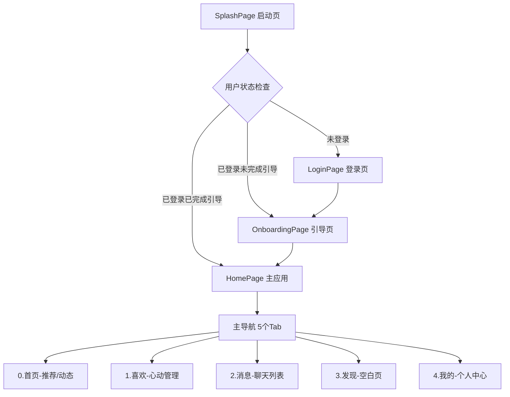
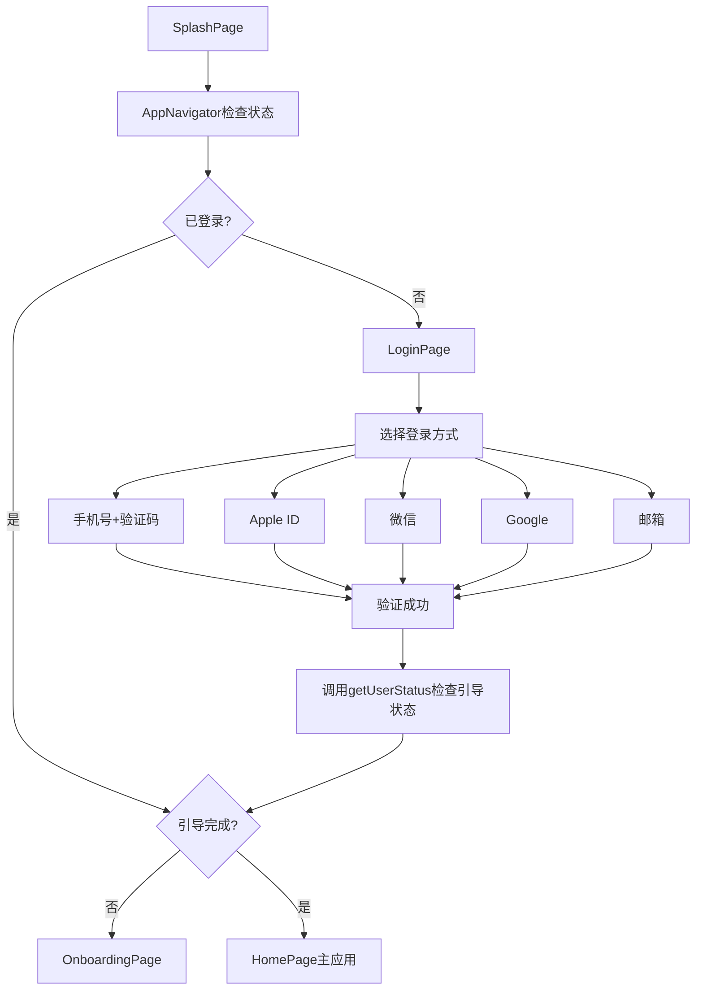
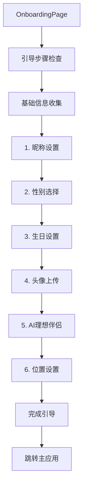
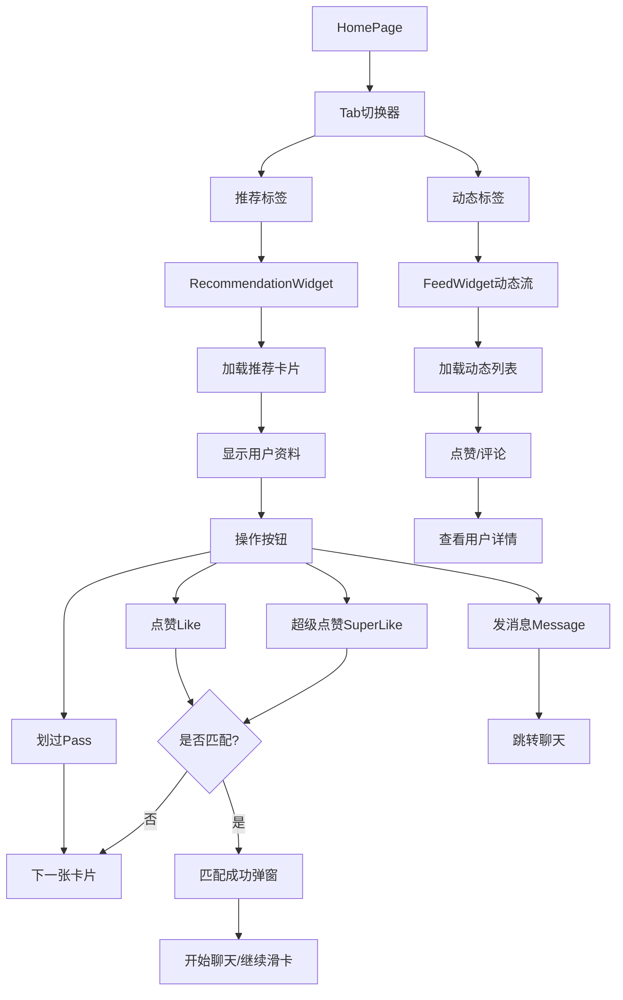
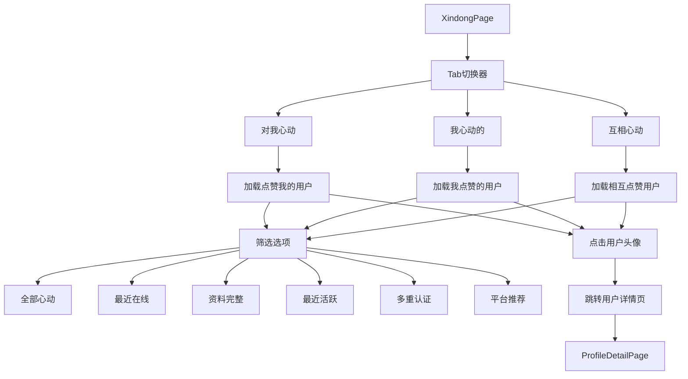
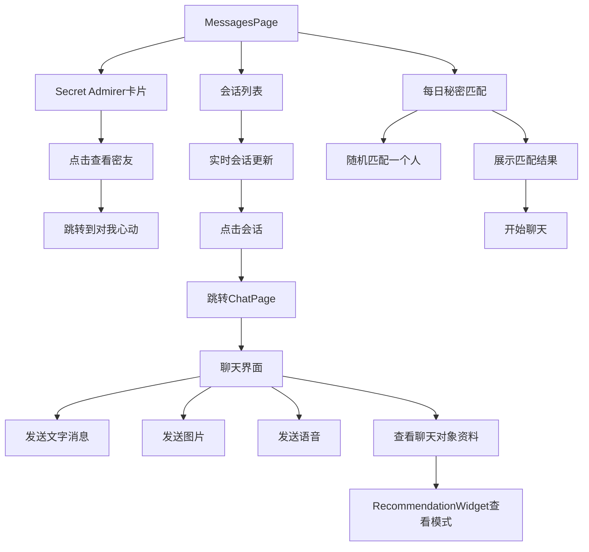
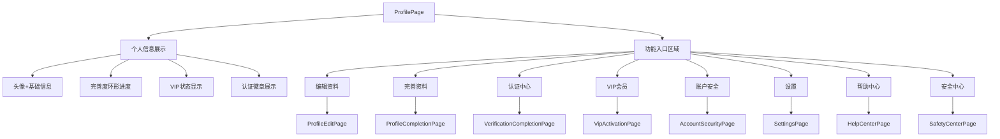
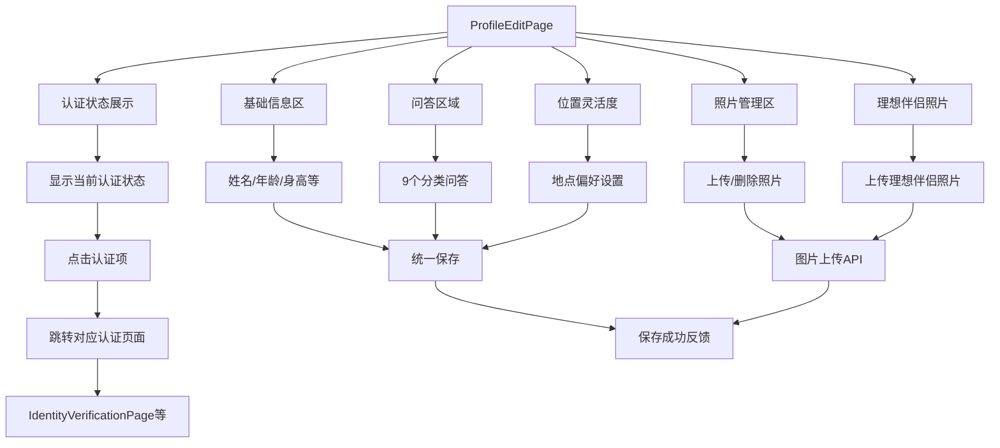
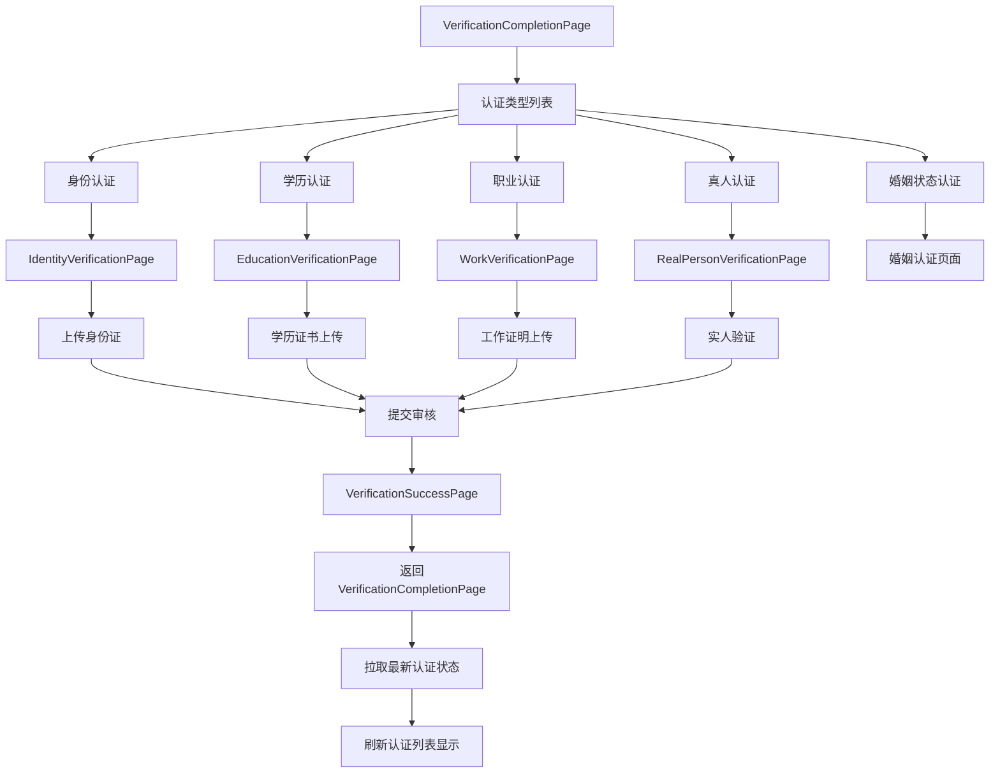

# Amoure 用户工作流程与前后端数据协议

_版本：v1.0 - 2025-01-30_

## 1. 文档概述

本文档定义慕尔交友应用的完整用户工作流程，明确每个页面的导航关系、数据需求和前后端 API 协议，为重构提供统一标准。

## 2. 应用架构总览

### 2.1 导航层次结构

### 2.2 底部导航栏结构

| Tab索引 | 标签名 | 页面类 | 主要功能 | 图标 |
|---------|--------|--------|----------|------|
| 0 | 首页 | `HomePage` | 推荐卡片 + 动态信息流 | shouye.png |
| 1 | 喜欢 | `XindongPage` | 对我心动/我心动的/互相心动 | xindong.png |
| 2 | 消息 | `MessagesPage` | 聊天列表 + Secret Admirer | message.png |
| 3 | 发现 | 占位页面 | 待开发功能 | xianxia.png |
| 4 | 我的 | `ProfilePage` | 个人资料 + 设置入口 | wode.png |

## 3. 详细用户工作流程

### 3.1 认证流程

#### 3.1.1 启动与登录

**数据需求 - LoginPage**

| API 端点 | 请求数据 | 响应数据 | 用途 |
|----------|----------|----------|------|
| `POST /api/app/auth/login` | 登录凭证 | JWT token + userId | 用户认证 |
| `GET /api/app/user/getUserStatus` | - | `UserStatusVO` | 检查引导状态 |
| `POST /api/app/auth/bindWechat` | 微信授权码 | 绑定结果 | 微信登录 |
| `POST /api/app/auth/bindApple` | Apple token | 绑定结果 | Apple ID登录 |
| `POST /api/app/auth/bindGoogle` | Google token | 绑定结果 | Google登录 |

#### 3.1.2 用户引导流程

**数据需求 - OnboardingPage**

| 步骤 | API 端点 | 请求数据 | 响应数据 |
| ---- | -------- | -------- | -------- |
| 保存进度 | `POST /api/app/user/saveBasicInfo` | 基础信息 | 保存结果 |
| 上传头像 | `POST /api/app/file/upload` | 图片文件 | 头像URL |
| AI理想伴侣 | `POST /api/app/ai/generateIdealPartner` | 偏好描述 | AI头像URL |
| 完成引导 | `POST /api/app/user/completeOnboarding` | 完整资料 | 完成状态 |

### 3.2 主应用流程

#### 3.2.1 首页 (Tab 0) - HomePage

**数据需求 - HomePage推荐标签**

| 场景 | API 端点 | 请求数据 | 响应数据 |
|------|----------|----------|----------|
| 加载推荐 | `GET /api/app/recommend/users` | limit=15 | `RecommendationCardDTO[]` |
| 用户操作 | `POST /api/app/interaction/like` | targetUserId | 匹配结果 |
| 用户操作 | `POST /api/app/interaction/pass` | targetUserId | 操作结果 |
| 用户操作 | `POST /api/app/interaction/superLike` | targetUserId | 匹配结果 |
| 查看详情 | `GET /api/app/user/getUserDetail/{userId}` | - | `UserProfileDTO` |

**数据需求 - HomePage动态标签**

| 场景 | API 端点 | 请求数据 | 响应数据 |
|------|----------|----------|----------|
| 加载动态 | `GET /api/app/post/getRecommend` | page, limit | `PostDetail[]` |
| 点赞动态 | `POST /api/app/post/like` | postId | 点赞结果 |
| 评论动态 | `POST /api/app/post/comment` | postId, content | 评论结果 |
| 查看详情 | `GET /api/app/post/getDetail/{postId}` | - | 完整动态详情 |

#### 3.2.2 喜欢页 (Tab 1) - XindongPage

**数据需求 - XindongPage**

| Tab | API 端点 | 请求数据 | 响应数据 |
|-----|----------|----------|----------|
| 对我心动 | `GET /api/app/interaction/getLikedMe` | page, limit, filter | `LikeUserVO[]` |
| 我心动的 | `GET /api/app/interaction/getMyLikes` | page, limit, filter | `LikeUserVO[]` |
| 互相心动 | `GET /api/app/interaction/getMutualLikes` | page, limit, filter | `LikeUserVO[]` |

#### 3.2.3 消息页 (Tab 2) - MessagesPage

**数据需求 - MessagesPage**

| 功能 | API 端点 | 请求数据 | 响应数据 |
| ---- | -------- | -------- | -------- |
| 密友信息 | `GET /api/app/interaction/getSecretAdmirer` | - | 密友统计 |
| 会话列表 | `GET /api/app/im/conversationList` | - | 会话列表 |
| 每日秘密匹配 | `GET /api/app/interaction/getDailySecretMatch` (待实现) | - | 匹配用户信息 |
| 实时更新 | WebSocket/腾讯IM | - | 消息推送 |

**数据需求 - ChatPage**

| 功能 | API 端点 | 请求数据 | 响应数据 |
|------|----------|----------|----------|
| 加载历史 | 腾讯IM SDK | conversationId | 历史消息 |
| 发送消息 | 腾讯IM SDK | 消息内容 | 发送结果 |
| 上传媒体 | `POST /api/app/file/upload` | 文件 | 媒体URL |
| 获取用户信息 | `GET /api/app/user/getFriendsDetail/{userId}` | - | 好友详情 |

#### 3.2.4 我的页 (Tab 4) - ProfilePage

**数据需求 - ProfilePage**

| 功能区域 | API 端点 | 请求数据 | 响应数据 |
|----------|----------|----------|----------|
| 个人信息 | `GET /api/app/user/getUserDetail` | - | 完整用户资料 |
| VIP状态 | 包含在用户详情中 | - | VIP信息 |
| 认证状态 | 包含在用户详情中 | - | 认证列表 |

### 3.3 详情页面流程

#### 3.3.1 个人资料编辑 - ProfileEditPage

#### 3.3.2 认证中心 - VerificationCompletionPage

## 4. 性能优化策略

### 4.1 数据加载策略

| 场景 | 策略 | 说明 |
|------|------|------|
| 推荐卡片 | 分批预加载 | 一次请求15张，滑到第10张时预加载下一批 |
| 用户照片 | 渐进式加载 | 头像优先，详情照片按需加载 |
| 聊天历史 | 分页+缓存 | 最新20条优先，向上滚动时分页加载 |
| 动态列表 | 虚拟滚动 | 大列表采用虚拟滚动组件 |

### 4.2 缓存策略

| 数据类型 | 缓存时长 | 存储位置 | 更新策略 |
|----------|----------|----------|----------|
| 用户基础信息 | 30分钟 | 内存 | 主动刷新 |
| 推荐卡片 | 1小时 | SharedPreferences | 滑完自动更新 |
| 聊天会话列表 | 实时 | 内存+本地 | 推送更新 |
| 动态列表 | 15分钟 | 内存 | 下拉刷新 |

### 4.3 网络优化

1. **请求合并**: 多个小请求合并为批量请求
2. **图片优化**: WebP格式 + 多尺寸适配
3. **压缩传输**: 启用Gzip/Brotli压缩
4. **CDN加速**: 静态资源走CDN

## 5. 安全与隐私策略

### 5.1 数据脱敏

| 敏感字段 | 脱敏策略 | 示例 |
|----------|----------|------|
| 真实姓名 | L1/L2层不返回 | 仅在L3详情页显示 |
| 精确位置 | 模糊化处理 | 3.2km → 3km |
| 手机号 | 加密传输 | 仅绑定接口可见 |
| 身份证号 | 部分遮掩 | 110101********1234 |

### 5.2 权限控制

| 操作 | 权限要求 | 验证方式 |
|------|----------|----------|
| 查看完整资料 | 已互相点赞/VIP | 后端验证 |
| 发起聊天 | 互相点赞 | IM权限检查 |
| 查看联系方式 | VIP+验证通过 | 多重验证 |
| 超级点赞 | 每日限额/VIP | 配额检查 |

## 6. 错误处理与兜底策略

### 6.1 网络异常

| 异常类型 | 处理策略 | 用户体验 |
|----------|----------|----------|
| 请求超时 | 3次重试 | Loading状态 |
| 网络中断 | 离线模式 | 显示缓存数据 |
| 服务器错误 | 降级服务 | 简化功能 |
| 认证失效 | 自动续期 | 无感知刷新 |

### 6.2 数据异常

| 数据问题 | 兜底方案 | 示例 |
|----------|----------|------|
| 头像加载失败 | 默认头像 | 显示初始化头像 |
| 推荐列表为空 | 历史数据 | 显示上次推荐 |
| 聊天消息丢失 | 重新拉取 | 自动同步历史 |
| 用户资料缺失 | 占位内容 | "暂未填写" |

## 7. 监控与埋点

### 7.1 性能监控

| 指标 | 目标值 | 监控方式 |
|------|--------|----------|
| 首屏加载时间 | <2s | 前端埋点 |
| API响应时间 | <500ms | 后端监控 |
| 推荐滑卡流畅度 | >60fps | 性能分析 |
| 聊天消息延迟 | <100ms | IM监控 |

### 7.2 业务埋点

| 事件 | 参数 | 用途 |
|------|------|------|
| 用户点赞 | userId, isMatch | 算法优化 |
| 卡片滑动 | direction, duration | 交互分析 |
| 聊天发送 | messageType, length | 功能统计 |
| 页面访问 | pageName, duration | 用户行为 |

---

**维护说明**  
本文档应与代码实现保持同步，每次功能迭代后及时更新对应的工作流程和数据协议定义。

_文档完_ 