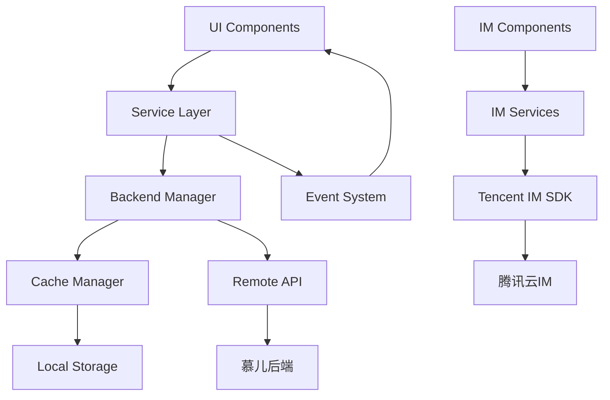

# 慕儿交友应用 - 项目架构分析报告

## 1. 项目概述

### 1.1 项目简介
慕儿是一个基于 Flutter 开发的现代化社交交友应用，采用滑卡式匹配机制，为用户提供安全、可信的交友平台。项目于2025年进行了重大重构，引入了统一的后端用户资料模型、全新的服务层架构，以及与React Native版本的API对齐。

### 1.2 核心特色
- **发现机制**: 每日15个精准推荐 + 公共动态信息流
- **互动系统**: 点赞、划过、超级点赞、屏蔽/举报、实时聊天
- **信任体系**: 多级身份验证、信任徽章、内容审核
- **个性化**: UnifiedUserProfile确保数据一致性

### 1.3 技术栈
- **前端框架**: Flutter 3.22 (空安全)
- **状态管理**: GetX + Provider (计划迁移到Riverpod)
- **即时通讯**: 腾讯云IM SDK
- **本地存储**: SharedPreferences (计划升级到Hive)
- **网络请求**: HTTP + Dio
- **国际化**: 准备支持中英文双语

## 2. 架构设计

### 2.1 整体架构
```
┌─────────────────────────────────────────────────────────────┐
│                        UI Layer                             │
│  ┌─────────────┐ ┌─────────────┐ ┌─────────────┐           │
│  │    Pages    │ │   Widgets   │ │ Navigation  │           │
│  └─────────────┘ └─────────────┘ └─────────────┘           │
└─────────────────────────────────────────────────────────────┘
                              │
┌─────────────────────────────────────────────────────────────┐
│                     Service Layer                           │
│  ┌─────────────┐ ┌─────────────┐ ┌─────────────┐           │
│  │ Auth Service│ │Profile Svc. │ │  Chat Svc.  │           │
│  └─────────────┘ └─────────────┘ └─────────────┘           │
│  ┌─────────────┐ ┌─────────────┐ ┌─────────────┐           │
│  │Recommend.Svc│ │Interact.Svc.│ │Verify.Svc.  │           │
│  └─────────────┘ └─────────────┘ └─────────────┘           │
└─────────────────────────────────────────────────────────────┘
                              │
┌─────────────────────────────────────────────────────────────┐
│                    Manager Layer                            │
│  ┌─────────────┐ ┌─────────────┐ ┌─────────────┐           │
│  │Backend Mgr. │ │  Cache Mgr. │ │IM Auth Mgr. │           │
│  └─────────────┘ └─────────────┘ └─────────────┘           │
└─────────────────────────────────────────────────────────────┘
                              │
┌─────────────────────────────────────────────────────────────┐
│                     Data Layer                              │
│  ┌─────────────┐ ┌─────────────┐ ┌─────────────┐           │
│  │   Models    │ │ Local Cache │ │ Remote API  │           │
│  └─────────────┘ └─────────────┘ └─────────────┘           │
└─────────────────────────────────────────────────────────────┘
```

### 2.2 模块划分

#### 2.2.1 核心功能模块
1. **用户认证模块** (`lib/services/auth_*`)
   - 多种登录方式（手机号、邮箱、Apple ID、Google、微信）
   - JWT token管理
   - 会话状态管理

2. **用户资料模块** (`lib/services/user_*`)
   - 统一的用户资料管理
   - 照片上传和管理
   - 个人信息编辑
   - 问答系统

3. **推荐匹配模块** (`lib/services/user_recommendation_service.dart`)
   - 每日推荐算法
   - 用户筛选
   - 匹配度计算

4. **互动系统模块** (`lib/services/user_interaction_service.dart`)
   - 点赞/划过/超级点赞
   - 匹配检测
   - 举报和屏蔽

5. **即时通讯模块** (`lib/services/tencent_im_service.dart`)
   - 腾讯云IM集成
   - 实时消息收发
   - 会话管理

6. **动态内容模块** (`lib/services/feed_service.dart`)
   - 社交动态发布
   - 内容互动
   - 动态推荐

7. **认证验证模块** (`lib/services/verification_service.dart`)
   - 身份认证
   - 学历认证
   - 工作认证
   - 真人认证

#### 2.2.2 辅助功能模块
1. **设置管理模块**
   - 账户安全设置
   - 通知设置
   - 隐私设置

2. **帮助客服模块**
   - 帮助中心
   - 工单系统
   - 在线客服

3. **支付会员模块**
   - VIP功能
   - 订单管理
   - 支付集成

### 2.3 数据流架构


## 3. 用户故事 (User Stories)

### 3.1 用户注册与认证
**角色**: 新用户
**需求**: 我想要安全地注册并完善个人资料

**用户故事**:
- 作为新用户，我希望可以通过多种方式注册（手机号、邮箱、第三方账号）
- 作为新用户，我希望有引导流程帮助我完善个人资料
- 作为注册用户，我希望能通过多种认证提升账户可信度
- 作为用户，我希望我的个人信息得到安全保护

**验收标准**:
- [x] 支持手机号+验证码注册登录
- [x] 支持Apple ID、Google、微信第三方登录
- [x] 提供新手引导流程
- [x] 支持身份认证、学历认证、工作认证
- [x] 个人信息加密存储

### 3.2 个人资料管理
**角色**: 注册用户
**需求**: 我想要管理和展示我的个人信息

**用户故事**:
- 作为用户，我希望能够编辑个人基本信息（姓名、年龄、身高、职业等）
- 作为用户，我希望能够上传和管理个人照片
- 作为用户，我希望能够回答个性化问题展示自己
- 作为用户，我希望能够设置位置偏好
- 作为用户，我希望看到资料完整度并获得完善建议

**验收标准**:
- [x] 提供完整的个人信息编辑界面
- [x] 支持最多6张照片上传
- [x] 提供9个分类的个性化问答
- [x] 支持地理位置偏好设置
- [x] 实时显示资料完整度百分比

### 3.3 用户发现与匹配
**角色**: 活跃用户
**需求**: 我想要发现合适的交友对象

**用户故事**:
- 作为用户，我希望每天收到高质量的推荐用户
- 作为用户，我希望能够通过滑卡方式快速筛选
- 作为用户，我希望能够使用超级点赞表达强烈兴趣
- 作为用户，我希望能够设置筛选条件
- 作为用户，我希望能够查看详细的用户资料

**验收标准**:
- [x] 每日提供15个高质量推荐
- [x] 支持点赞、划过、超级点赞操作
- [x] 提供详细的筛选设置
- [x] 显示用户完整资料和验证状态
- [x] 推荐算法考虑地理位置和偏好

### 3.4 互动与聊天
**角色**: 匹配用户
**需求**: 我想要与匹配的用户进行交流

**用户故事**:
- 作为用户，我希望能看到谁点赞了我
- 作为用户，我希望在相互点赞后能开始聊天
- 作为用户，我希望能发送文字、图片、语音消息
- 作为用户，我希望能看到消息已读状态
- 作为用户，我希望能举报不当行为

**验收标准**:
- [x] 提供"谁喜欢我"、"我喜欢的"、"相互喜欢"管理页面
- [x] 相互点赞后自动创建聊天会话
- [x] 支持多媒体消息发送
- [x] 实时消息传输和已读状态
- [x] 完善的举报和屏蔽机制

### 3.5 社交动态
**角色**: 社交用户
**需求**: 我想要分享生活动态并看到他人分享

**用户故事**:
- 作为用户，我希望能够发布带图片的生活动态
- 作为用户，我希望能够浏览其他用户的动态
- 作为用户，我希望能够对动态进行点赞和评论
- 作为用户，我希望通过动态了解更多用户

**验收标准**:
- [x] 支持图文动态发布
- [x] 提供动态信息流浏览
- [x] 支持点赞和评论互动
- [x] 动态与用户资料关联
- [ ] 动态推荐算法（开发中）

### 3.6 安全与客服
**角色**: 所有用户
**需求**: 我希望在安全的环境中使用应用

**用户故事**:
- 作为用户，我希望能够举报不当内容和行为
- 作为用户，我希望能够获得帮助和客服支持
- 作为用户，我希望我的隐私得到保护
- 作为用户，我希望能够控制谁能联系我

**验收标准**:
- [x] 完善的举报系统
- [x] 多渠道客服支持
- [x] 隐私设置控制
- [x] 内容审核机制
- [x] 用户行为监控

## 4. 数据模型设计

### 4.1 核心数据模型

#### 4.1.1 用户模型 (User)
```dart
class User {
  // 基础身份信息
  final String id;                  // 用户唯一标识
  final String nickname;            // 昵称
  final String? realName;           // 真实姓名
  final int? age;                   // 年龄
  final String? gender;             // 性别
  final DateTime? birthDate;        // 出生日期
  
  // 外观信息
  final int? height;                // 身高(cm)
  final int? weight;                // 体重(kg)
  final String? zodiac;             // 星座
  
  // 教育和职业
  final String? education;          // 教育背景
  final String? school;             // 学校
  final String? occupation;         // 职业
  final String? company;            // 公司
  final String? incomeRange;        // 收入范围
  
  // 位置信息
  final String? currentLocation;    // 当前位置
  final String? hometown;           // 家乡
  final String? locationCode;       // 位置编码
  final double? latitude;           // 纬度
  final double? longitude;          // 经度
  
  // 个人状态
  final String? marriageStatus;     // 婚姻状态
  final int? hasChildren;           // 是否有孩子
  final int? wantChildren;          // 是否想要孩子
  final String? religion;           // 宗教信仰
  final String? smokingHabit;       // 吸烟习惯
  final String? drinkingHabit;      // 饮酒习惯
  final List<String> hobbies;       // 兴趣爱好
  
  // 平台信息
  final int activeDays;             // 活跃天数
  final DateTime? lastActiveTime;   // 最后活跃时间
  final int trustScore;             // 信任分数
  final UserStatus status;          // 用户状态
  final Verification verification;  // 认证信息
  
  // 媒体内容
  final List<String> photos;        // 照片列表
  final String? avatarUrl;          // 头像URL
  final List<String> postPhotos;    // 动态照片
  
  // 个人问答
  final List<QAAnswer> qaAnswers;   // 问答回答
  final List<LocationFlexibilityAnswer> locationFlexibilityAnswers;
  
  // VIP信息
  final bool get isVipExpired;               // 是否过期
  final bool get vipLevel;
  final DateTime? vipPurchasedAt;      // 购买时间
  final int get vipDaysRemaining;            // 剩余天数
  
  // AI功能
  final String? idealPartnerAvatar; // AI生成的理想伴侣照片
  
  // 账号绑定信息
  final UserBinding binding;        // 绑定信息
  
  // 用户发布内容
  final List<String> publishedPostIds; // 用户发布的帖子ID列表
}
```

#### 4.1.2 账号绑定模型 (UserBinding)
```dart
class UserBinding {  
  // 手机绑定
  final String? phoneNumber;        // 手机号
  final bool phoneBindStatus;       // 手机绑定状态
  
  // 第三方绑定
  final bool wechatBindStatus;      // 微信绑定状态
  final Map<String, dynamic>? wechatInfo; // 微信信息(昵称等)
  
  final bool appleBindStatus;       // Apple ID绑定状态
  final Map<String, dynamic>? appleInfo; // Apple信息
  
  final bool emailBindStatus;       // 邮箱绑定状态
  final Map<String, dynamic>? emailInfo; // 邮箱信息
  
  final bool googleBindStatus;      // Google绑定状态
  final Map<String, dynamic>? googleInfo; // Google信息
  
  // 用户ID
  final String uid;                 // 用户唯一标识
}
```

#### 4.1.3 问答模型 (QAAnswer)
```dart
class QAAnswer {
  final String questionId;          // 问题ID
  final String question;            // 问题内容
  final List<String> options;       // 答案选项
  final String answer;              // 回答内容
  final String category;            // 问题分类
  final int order;                  // 显示顺序
}
```

#### 4.1.4 认证验证模型

##### 认证详情 (Verification)
```dart
class Verification {
  final int id;                     // 认证ID
  final VerificationStatusType type; // 认证类型 (IDENTITY/EDUCATION/CAREER/REAL_PERSON/MARRIAGE)
  final String description;         // 认证描述
  final List<String> documentUrls;  // 认证文档URL列表
  final String status;              // 认证状态 (pending/approved/rejected)
  final int? trustScore;            // 信任分数
}
```

##### 认证类型枚举 (VerificationStatusType)
```dart
enum VerificationStatusType {
  IDENTITY,    // 身份认证
  EDUCATION,   // 学历认证
  CAREER,      // 职业认证
  REAL_PERSON, // 真人认证
  MARRIAGE,    // 婚姻状态认证
}
```

##### 认证状态类型
```dart
enum VerificationStatusType {
  none,                             // 未认证
  pending,                          // 审核中
  approved,                         // 已通过
  rejected,                         // 已拒绝
}
```

#### 4.1.3 照片管理模型

##### 用户照片 (ProfilePhoto)
```dart
class ProfilePhoto {
  final String id;                  // 照片ID
  final String url;                 // 照片URL
  final int? order;                 // 显示顺序
  final bool isMain;                // 是否主照片
  final DateTime? uploadedAt;       // 上传时间
  final String? photoType;          // 照片类型 (AVATAR/ALBUM)
}
```

#### 4.1.4 即时通讯模型

##### 消息模型 (MessageModel)
```dart
class MessageModel {
  final String id;                  // 消息ID
  final String conversationId;      // 会话ID
  final String senderId;            // 发送者ID
  final String receiverId;          // 接收者ID
  final MessageType type;           // 消息类型
  final String content;             // 消息内容
  final String? mediaUrl;           // 媒体URL
  final DateTime timestamp;         // 时间戳
  final MessageStatus status;       // 消息状态
  final bool isRead;                // 是否已读
  final bool isRevoked;             // 是否撤回
}
```

##### IM用户资料 (IMUserProfile)
```dart
class IMUserProfile {
  final String userID;              // 用户ID
  final String? nickname;           // 昵称
  final String? faceUrl;            // 头像URL
  final int? gender;                // 性别 (1-男 2-女)
  final Map<String, dynamic>? customInfo; // 自定义信息
}
```

#### 4.1.6 动态内容模型 (PostDetail)
```dart
class Post {
  final String id;                  // 动态ID
  final String userId;              // 发布者ID
  final String userName;            // 发布者名称
  final String? userAvatar;         // 发布者头像
  final String content;             // 动态内容
  final List<String> images;        // 图片列表
  final int likeCount;              // 点赞数
  final int commentCount;           // 评论数
  final bool isLiked;               // 是否已点赞
  final DateTime createdAt;         // 创建时间
  final String? location;           // 位置信息
  final List<String> tags;          // 标签
}
```

### 4.2 即时通讯数据模型

**重要说明**: 由于应用直接集成腾讯云IM SDK，我们移除了自定义的MessageModel和ConversationModel。聊天系统采用简化的Map格式，直接适配UI层需求。

#### 4.2.1 聊天消息格式 (Chat UI Models)
```dart
// ChatService使用的消息格式 - 适配ChatPage UI需求
Map<String, dynamic> chatMessage = {
  'text': String,                   // 消息文本内容
  'isMe': bool,                     // 是否我发送的消息
  'time': String,                   // 显示时间 (HH:mm格式)
  'type': String,                   // 消息类型 (text/image/voice/video)
  'timestamp': int,                 // 时间戳 (秒)
  'msgID': String?,                 // 腾讯云消息ID
  'status': String,                 // 消息状态 (sending/success/failed)
  'isLiked': bool,                  // 是否被点赞
  
  // 语音消息专用
  'duration': int?,                 // 语音时长(秒)
  'filePath': String?,              // 文件路径/URL
  
  // 图片消息专用
  'imagePath': String?,             // 图片路径/URL
  'imageUrl': String?,              // 图片云端URL
  
  // 文件消息专用
  'fileName': String?,              // 文件名
  'fileSize': int?,                 // 文件大小
  
  // 元数据 (从腾讯云IM获取)
  'sender': String?,                // 发送者IM ID
  'senderUserId': String?,          // 发送者用户ID
  'receiver': String?,              // 接收者IM ID
};
```

#### 4.2.2 会话列表格式 (Conversation UI Models)
```dart
// ConversationService使用的会话格式 - 适配MessagesPage UI需求
Map<String, dynamic> conversation = {
  'conversationId': String?,        // 会话ID
  'userName': String,               // 用户名/昵称
  'userAvatar': String?,            // 用户头像URL
  'message': String,                // 最后一条消息预览
  'time': String,                   // 时间显示文本
  'isRead': bool,                   // 是否已读
  'hasNotification': bool,          // 是否有通知红点
  'unreadCount': int,               // 未读消息数
  'imUserId': String?,              // 腾讯云IM用户ID (格式: amoure_xxx)
  'targetUserId': String?,          // 目标用户的业务ID
};
```

#### 4.2.3 密友信息格式 (Secret Admirer)
```dart
// Secret Admirer卡片数据格式
Map<String, dynamic> secretAdmirer = {
  'count': int,                     // 密友数量
  'hasNew': bool,                   // 是否有新密友
  'latestAvatar': String?,          // 最新密友头像
};
``` 


#### 4.1.7 VIP会员模型

##### VIP信息 (VipInfo)
```dart
class VipInfo {
  final bool isVip;                 // 是否VIP
  final int level;                  // VIP等级
  final DateTime? duration;        // vip 时长
  final String packageName;         // 套餐名称
  final double? price;              // 价格
  final String? paymentMethod;      // 支付方式
}
```

#### 4.1.8 工单系统模型

##### 工单详情 (WorkOrderDetail)
```dart
class WorkOrderDetail {
  final String orderNo;             // 工单号
  final WorkOrderType type;                // 工单类型
  final String title;               // 工单标题
  final String content;             // 工单内容
  final int priority;               // 优先级
}
```

##### 工单类型枚举 (WorkOrderTypeEnum)
```dart
enum WorkOrderTypeEnum {
  SUGGESTION,    // 建议反馈
  APP_ISSUE,     // APP问题
  USAGE_HELP,    // 使用帮助
  COMPLAINT,     // 投诉
  SYSTEM_ERROR,  // 系统错误
}

// 工单类型配置
class WorkOrderType {
  final WorkOrderTypeEnum code;      // 类型代码
  final String name;                // 类型名称
  final String description;         // 类型描述
  final String icon;                // 图标
}
``


#### 4.1.9 帮助中心模型

##### 帮助分类 (HelpCategory)
```dart
class HelpCategory {
  final String code;                // 分类代码
  final String name;                // 分类名称
  final String? icon;               // 分类图标
  final int sortOrder;              // 排序顺序
  final int articleCount;           // 文章数量
}
```

##### 帮助文章 (HelpArticleDetail)
```dart
class HelpArticleDetail {
  final int id;                     // 文章ID
  final String title;               // 文章标题
  final HelpCategory category;            // 文章分类
  final String content;             // 文章内容
  final int isRecommend;            // 是否推荐
  final int sortOrder;              // 排序顺序
}
```


## 5. API 设计规范

### 5.1 API 架构概览
```
/api/app/
├── auth/                    # 认证相关
├── user/                    # 用户资料
├── recommend/               # 推荐系统
├── interaction/             # 用户互动
├── im/                      # 即时通讯
├── post/                    # 动态内容
├── verify/                  # 认证验证
├── help/                    # 帮助中心
├── workOrder/               # 工单系统
├── vipPackage/              # 会员功能
├── order/                   # 订单系统
├── notification/            # 通知设置
├── report/                  # 举报系统
├── contact/                 # 联系客服
├── dict/                    # 字典数据
├── file/                    # 文件上传
└── oss/                     # 对象存储
```

### 5.2 核心API端点详情

#### 5.2.1 用户认证 API
```
POST /api/app/auth/login              # 用户登录
POST /api/app/auth/logout             # 退出登录
POST /api/app/auth/bindWechat         # 绑定微信
POST /api/app/auth/bindApple          # 绑定Apple ID
POST /api/app/auth/bindPhone          # 绑定手机号
POST /api/app/auth/bindEmail          # 绑定邮箱
POST /api/app/auth/bindGoogle         # 绑定Google
```

#### 5.2.2 用户资料 API
```
GET  /api/app/user/getUserDetail      # 获取用户详情
POST /api/app/user/saveBasicInfo      # 保存基础信息
POST /api/app/user/saveProfile        # 保存详细资料
POST /api/app/user/savePhoto          # 保存照片
GET  /api/app/user/getPhotoList       # 获取照片列表
GET  /api/app/user/getUserStatus      # 获取用户状态
GET  /api/app/user/getFriendsDetail   # 获取好友详情
```

#### 5.2.3 推荐系统 API
```
GET  /api/app/recommend/users         # 获取推荐用户列表
POST /api/app/recommend/trigger-job   # 手动触发推荐任务
```

#### 5.2.4 用户互动 API
```
POST /api/app/interaction/like        # 点赞用户
POST /api/app/interaction/pass        # 划过用户
POST /api/app/interaction/superLike   # 超级点赞
GET  /api/app/interaction/getLikedMe  # 获取点赞我的用户
GET  /api/app/interaction/getMyLikes  # 获取我点赞的用户
GET  /api/app/interaction/getMutualLikes # 获取相互点赞的用户
```

#### 5.2.5 即时通讯 API
```
GET  /api/app/im/conversationList     # 获取会话列表
POST /api/app/im/sendMessage          # 发送消息
PUT  /api/app/im/markRead             # 标记消息已读
GET  /api/app/im/checkPermission      # 检查聊天权限
POST /api/app/im/refreshUserSig       # 刷新IM用户签名
```

#### 5.2.6 动态内容 API
```
GET  /api/app/post/getRecommend       # 获取推荐动态
GET  /api/app/post/getDetail          # 获取动态详情
POST /api/app/post/like               # 点赞动态
POST /api/app/post/comment            # 评论动态
POST /api/app/post/create             # 创建动态
DELETE /api/app/post/delete           # 删除动态
```

### 5.3 API 响应格式规范
```json
{
  "code": 0,                          // 响应码，0表示成功
  "success": true,                    // 是否成功
  "message": "操作成功",               // 响应消息
  "data": {                           // 响应数据
    // 具体业务数据
  },
  "timestamp": "2025-01-15T10:30:00Z" // 响应时间
}
```

### 5.4 错误码规范
| 错误码范围 | 模块 | 说明 |
|-----------|------|------|
| 1000-1999 | 认证模块 | 登录、注册、权限相关错误 |
| 2000-2999 | 用户模块 | 用户资料、个人信息相关错误 |
| 3000-3999 | 推荐模块 | 推荐算法、匹配相关错误 |
| 4000-4999 | 互动模块 | 点赞、消息、互动相关错误 |
| 5000-5999 | 内容模块 | 动态、媒体相关错误 |
| 6000-6999 | 系统模块 | 系统级错误 |

## 6. 技术特色与亮点

### 6.1 架构设计亮点
1. **统一数据模型**: UnifiedUserProfile确保全应用数据一致性
2. **服务层分离**: 清晰的职责分工，高内聚低耦合
3. **缓存策略**: 多层缓存设计，优化用户体验
4. **状态管理**: 计划迁移到Riverpod，提升状态管理效率

### 6.2 用户体验亮点
1. **滑卡交互**: 流畅的卡片滑动动画和交互
2. **实时通讯**: 基于腾讯云IM的稳定消息系统
3. **智能推荐**: 基于AI的个性化用户推荐
4. **多重认证**: 提升平台信任度和安全性

### 6.3 技术创新点
1. **AI驱动**: AI生成理想伴侣照片功能
2. **多模态交互**: 支持文字、语音、图片、表情包
3. **地理智能**: 基于位置的智能匹配和偏好设置
4. **国际化准备**: 完整的双语支持架构

## 7. 项目现状与重构计划

### 7.1 当前状态
- ✅ 核心功能完备：注册、资料、推荐、匹配、聊天
- ✅ 服务层重构完成：统一的服务架构
- ✅ 数据模型统一：UnifiedUserProfile模型
- ✅ 即时通讯集成：腾讯云IM SDK
- 🔄 动态功能开发中：后端接口和分页功能
- ⏳ 状态管理升级：计划迁移到Riverpod
- ⏳ 国际化支持：中英文双语准备中

### 7.2 重构成果
1. **UserService迁移**: 14个文件从UserProfileService迁移到UserService
2. **API统一**: 与React Native版本API对齐
3. **缓存优化**: BackendManager自动缓存管理
4. **代码质量**: 更好的类型安全和错误处理

### 7.3 未来计划
1. **功能完善**
   - 完成动态标签页后端功能
   - 引入推送通知系统
   - 实现高级订阅功能

2. **技术升级**
   - 迁移到Riverpod状态管理
   - 升级到Hive本地存储
   - 完善测试覆盖率

3. **体验优化**
   - 优化推荐算法
   - 增强聊天功能（语音/视频通话）
   - 完善内容审核机制

## 8. 性能与质量保证

### 8.1 性能优化策略
1. **网络优化**: 请求去重、缓存策略、离线支持
2. **UI优化**: 懒加载、虚拟列表、图片压缩
3. **内存优化**: 及时释放资源、合理的缓存策略
4. **包体积优化**: 资源压缩、代码分割

### 8.2 质量保证体系
1. **代码质量**: ESLint规则、代码审查、单元测试
2. **用户体验**: UI测试、性能监控、用户反馈
3. **安全保障**: 数据加密、权限控制、安全审计
4. **稳定性**: 异常处理、降级策略、监控告警

### 8.3 测试策略
1. **单元测试**: 服务层和工具函数测试
2. **集成测试**: 页面和组件集成测试
3. **E2E测试**: 核心用户流程端到端测试
4. **性能测试**: 关键场景性能基准测试

## 9. 总结与展望

### 9.1 项目优势
1. **技术架构先进**: Flutter跨平台，现代化架构设计
2. **功能完备**: 覆盖社交交友全流程
3. **用户体验优秀**: 流畅的交互和精美的UI
4. **安全可靠**: 多重认证和内容审核机制
5. **扩展性强**: 良好的架构设计支持后续功能扩展

### 9.2 技术债务
1. **状态管理**: 当前使用多种状态管理方案，需要统一
2. **国际化**: 硬编码中文字符串较多，需要系统性国际化
3. **测试覆盖**: 测试用例需要进一步完善
4. **文档完善**: 技术文档和API文档需要持续更新

### 9.3 数据模型完整性总结
基于代码分析，本次重新梳理并完善了以下数据模型：

#### 完整模型架构 (8大类，30+具体模型)
1. **用户核心模型**: User (含publishedPostIds), UserBinding (账号绑定), UserStatus
2. **认证验证模型**: Verification, VerificationStatusType (枚举)
3. **问答系统模型**: QAAnswer, LocationFlexibilityAnswer
4. **动态内容模型**: PostDetail, ReplyItem (帖子回复系统)
5. **VIP会员模型**: VipInfo (含完整权限管理)
6. **工单系统模型**: WorkOrderDetail, WorkOrderTypeEnum, WorkOrderPriority, WorkOrderStatus
7. **帮助中心模型**: HelpCategory, HelpArticleDetail
8. **即时通讯模型**: 简化的Map格式(适配腾讯云IM，移除自定义MessageModel/ConversationModel)

#### 关键更新说明
1. **用户模型增强**: 
   - 添加UserBinding账号绑定信息 (支持手机/微信/Apple/邮箱/Google)
   - 添加publishedPostIds字段追踪用户发布内容
   
2. **工单系统完善**:
   - 增加WorkOrderTypeEnum枚举 (SUGGESTION/APP_ISSUE/USAGE_HELP/COMPLAINT/SYSTEM_ERROR)
   - 完善优先级和状态管理
   
3. **帖子回复系统**:
   - 新增ReplyItem模型支持帖子回复功能
   - 支持嵌套回复和点赞机制
   
4. **即时通讯优化**:
   - 移除复杂的自定义IM模型，直接使用腾讯云IM
   - 采用轻量级Map格式适配UI需求
   - 支持文字/图片/语音/视频等多媒体消息

这些更新使得数据模型更加实用和高效，完全匹配当前代码实现。

### 9.4 发展前景
慕儿交友应用在技术架构和功能设计上都达到了行业先进水平，具备了支撑大规模用户使用的技术基础。通过持续的技术优化和功能迭代，有望成为领先的社交交友平台。

---

**文档版本**: v1.0  
**更新时间**: 2025年1月15日  
**维护人员**: 开发团队  

*本文档将随着项目发展持续更新和完善* 