# Amoure 推荐系统 Job 分析文档

## 概述

本文档分析了 Amoure 约会应用中现有的推荐系统Job实现，包括用户推荐、帖子热度计算和数据清理等定时任务。这些Job构成了整个推荐系统的核心基础设施。

---

## 核心Job组件

### 1. UserRecommendJob (用户推荐Job)

**执行时间**: 每天 00:01  
**主要职责**: 计算用户质量分数，生成推荐池，为活跃用户预生成推荐队列

#### 核心算法流程


#### 1.1 用户筛选条件
- **基础条件**:
  - `account_status = "ACTIVE"`
  - `machine_review_status = "APPROVED"`
  - 资料完整度 >= 70%

#### 1.2 用户分数计算
```java
总分 = VIP分数 + 点赞分数 + 登录分数

VIP分数 = user.score * 2
点赞分数 = 获得的喜欢和超级喜欢数量
登录分数 = {
    24小时内: 10分
    72小时内: 5分  
    超过72小时: 0分
}
```

#### 1.3 质量池分配
- **高质量池(HIGH)**: 前30%的用户
- **中等质量池(MEDIUM)**: 接下来50%的用户  
- **低质量池(LOW)**: 剩余20%的用户

#### 1.4 推荐队列生成策略
为每个活跃用户生成15个推荐用户：
- **30%** 来自高质量池 (4-5个用户)
- **50%** 来自中等质量池 (7-8个用户)
- **20%** 来自低质量池 (2-3个用户)

**排除逻辑**: 
- 排除自己
- 排除已互动过的用户(点赞/跳过/拉黑)

**缓存策略**: 
- Redis Key: `RECOMMEND_USERS_KEY + userId`
- 过期时间: 3天
- 数据格式: JSON数组包含用户ID列表

---

### 2. PostHotPoolJob (帖子热度池Job)

**执行时间**: 每2小时  
**主要职责**: 计算帖子热度分数，维护热门帖子池供推荐使用

#### 2.1 帖子筛选条件
- 发布时间: 最近1个月内
- 审核状态: 不等于"REJECTED"
- 删除状态: 未删除 (`is_deleted = 0`)
- 可见性: 公开可见 (`visibility = "PUBLIC"`)

#### 2.2 热度分数计算
```java
热度分数 = 点赞数*4 + 评论数*3 + 新鲜度加分

新鲜度加分 = {
    当天发布: +5分
    1-3天内发布: +3分
    超过3天: 0分
}
```

#### 2.3 热度池维护
- **池容量**: 最多1000条热门帖子
- **更新频率**: 每2小时重新计算
- **缓存策略**: Redis存储6小时过期
- **排序**: 按热度分数降序排列

---

### 3. UserDataCleanupJob (用户数据清理Job)

**执行时间**: 每天凌晨3点  
**主要职责**: 清理标记为DELETED状态超过30天的用户及其相关数据

#### 3.1 清理流程


#### 3.2 数据清理范围
- **互动数据**: 点赞、消息、对话记录
- **内容数据**: 用户发布的帖子和评论
- **举报数据**: 用户提交的举报记录
- **媒体文件**: OSS存储的照片和其他文件
- **基本信息**: 用户账号和档案数据

---

## 推荐系统架构分析

### 核心设计思路

#### 1. **分层推荐策略**
```
用户质量分层 → 推荐池分配 → 按比例推荐
高质量用户获得更多曝光机会
```

#### 2. **预计算缓存策略**
```
定时Job预计算 → Redis缓存 → 快速读取
减少实时计算压力，提升用户体验
```

#### 3. **排除机制**
```
已互动用户排除 → 避免重复推荐
提升推荐的新鲜度和有效性
```

#### 4. **兜底策略**
```
Redis缓存失效 → 数据库实时查询
确保服务的可用性和稳定性
```

### 技术特点

#### **优势**:
- ✅ **性能优化**: 预计算+缓存，响应快
- ✅ **质量保证**: 多维度评分，推荐质量高
- ✅ **新鲜度维护**: 定时更新，避免推荐重复
- ✅ **容错机制**: 兜底策略确保服务可用

#### **可优化点**:
- 🔄 **实时性不足**: 用户状态变化无法立即反映
- 🔄 **算法单一**: 基于分数的简单排序，缺少个性化
- 🔄 **扩展性**: 硬编码的比例分配，难以动态调整

---

## 推荐流程详解

### 用户推荐获取流程


### Job执行时机

```mermaid
gantt
    title 推荐系统Job执行时机
    dateFormat HH:mm
    axisFormat %H:%M
    
    section 每日任务
    用户推荐池计算    :done, rec-job, 00:01, 1h
    数据清理任务     :done, cleanup, 03:00, 2h
    
    section 周期任务  
    帖子热度池更新   :done, post1, 00:00, 30m
    帖子热度池更新   :done, post2, 02:00, 30m
    帖子热度池更新   :done, post3, 04:00, 30m
    帖子热度池更新   :done, post4, 06:00, 30m
```



---

## V2推荐系统设计建议

基于现有系统分析，V2推荐系统应该继承优点并解决现有问题：

### 建议的V2推荐Job设计

#### 1. **RecommendationV2Job**
```java
@Component 
public class RecommendationV2Job {
    
    @XxlJob("generateRecommendationPoolV2")
    public void generateRecommendationPool() {
        // 1. 获取符合条件的用户 (使用V2的UserService)
        // 2. 计算用户综合分数 (扩展评分维度)
        // 3. 智能分池算法 (动态比例调整)
        // 4. 个性化推荐生成 (基于用户偏好)
        // 5. 缓存优化存储 (Redis + 本地缓存)
    }
}
```

#### 2. **推荐算法增强**
```java
// 扩展的评分维度
UserScore calculateUserScore(UserInfo userInfo, UserProfile profile, List<UserVerification> verifications) {
    return UserScore.builder()
        .vipScore(calculateVipScore(userInfo))           // VIP等级分数
        .popularityScore(calculatePopularityScore())     // 受欢迎程度
        .activityScore(calculateActivityScore())         // 活跃度分数  
        .verificationScore(calculateVerificationScore(verifications)) // 认证分数
        .completenessScore(calculateCompletenessScore()) // 资料完整度
        .freshnessScore(calculateFreshnessScore())       // 新用户加分
        .build();
}
```

#### 3. **个性化推荐**
```java
// 基于用户偏好的推荐
List<Long> generatePersonalizedRecommendations(Long userId, UserPreferences preferences) {
    // 1. 根据年龄偏好过滤
    // 2. 根据地理位置偏好过滤  
    // 3. 根据兴趣标签匹配
    // 4. 根据教育职业偏好过滤
    // 5. 应用机器学习模型(可选)
}
```

### V2系统优势

1. **性能优化**: 复用V2的批量查询优化
2. **数据统一**: 使用统一的V2数据模型
3. **算法升级**: 更多维度的评分算法
4. **个性化**: 基于用户偏好的精准推荐
5. **监控完善**: 详细的执行指标和错误处理

---

## 总结

现有推荐系统采用了**预计算+缓存**的经典架构，通过**多维度评分**和**分层推荐**策略提供了良好的推荐效果。V2推荐系统应该在继承这些优秀设计的基础上，进一步优化算法精度和个性化程度。

**关键改进方向**:
1. 扩展评分维度，提升推荐质量
2. 引入个性化算法，提升匹配精度
3. 优化缓存策略，提升系统性能
4. 完善监控体系，提升运维效率