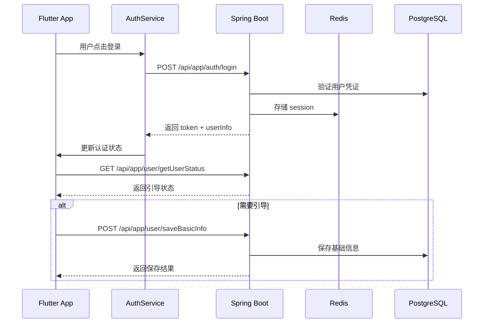
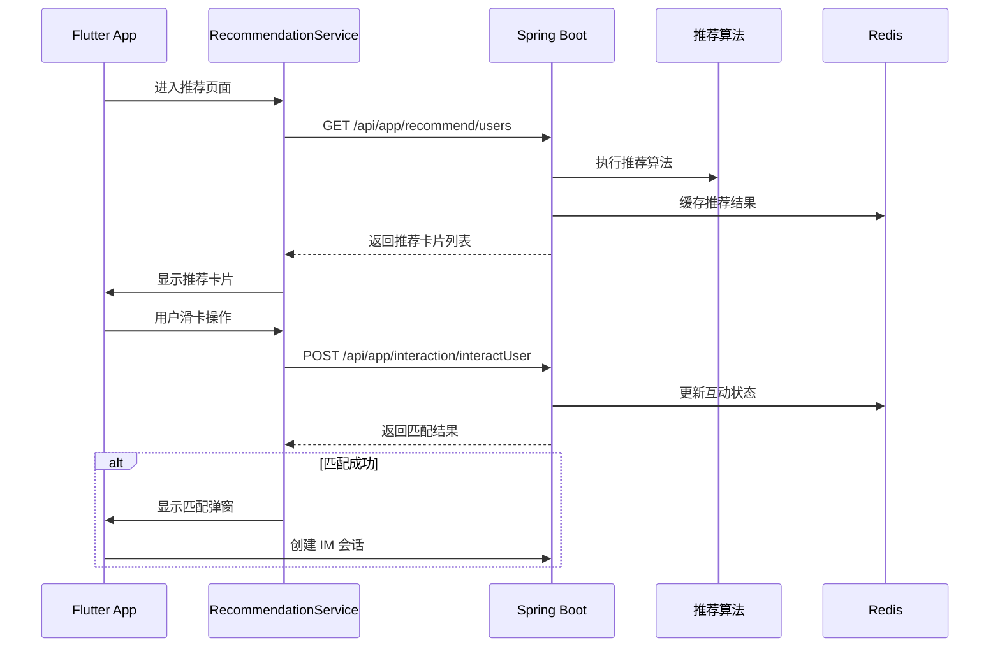
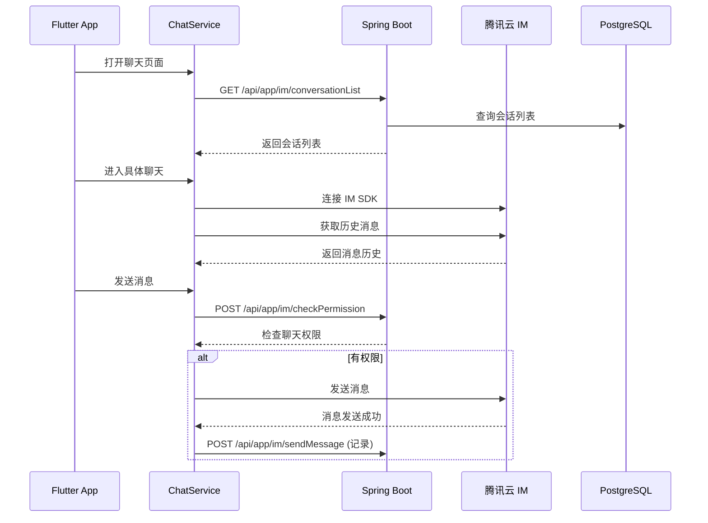

# Amoure 交友应用前后台 API 交互合约规范

## 文档概述

本文档定义了 Amoure 交友应用前台（Flutter）与后台（Spring Boot）之间的完整 API 交互合约，包括每个业务工作流程对应的 API 调用序列、数据格式、错误处理和性能要求。

### 版本信息
- **版本**: v1.0
- **创建日期**: 2025-01-15
- **维护团队**: Amoure 开发团队
- **适用范围**: Flutter 前端 + Spring Boot 后端

## 1. 系统架构概览

### 1.1 技术栈对照
| 层级 | 前台 (Flutter) | 后台 (Spring Boot) |
|------|---------------|-------------------|
| 应用框架 | Flutter 3.22 | Spring Boot 2.x |
| 状态管理 | GetX + Provider | Spring MVC |
| 网络层 | BackendManager + HTTP | RestController |
| 认证 | AuthSessionManager | Sa-Token |
| 缓存 | CacheManager | Redis + JetCache |
| 数据库 | 本地 SharedPreferences | PostgreSQL + MyBatis Plus |

### 1.2 服务端口配置
```yaml
# 后台服务端口
amoure-app:     8282  # 客户端 API 服务
amoure-manager: 8181  # 管理后台服务

# 前台配置
development: http://192.168.1.117:8282
test:        https://api.app-test.amoure.cn
production:  https://api.app.amoure.cn
```

## 2. API 设计规范

### 2.1 统一响应格式

所有 API 接口统一使用以下响应格式：

```json
{
  "code": 0,                    // 响应码: 0-成功, 其他-失败
  "success": true,              // 是否成功
  "message": "操作成功",         // 响应消息
  "data": {},                  // 响应数据(具体结构见各接口)
  "timestamp": "2025-01-15T10:30:00Z"  // 响应时间
}
```

### 2.2 错误码规范

| 错误码范围 | 模块 | 说明 |
|-----------|------|------|
| 0 | 成功 | 请求成功 |
| 1 | 通用失败 | 业务逻辑失败 |
| 103 | 系统异常 | 代码异常 |
| 104 | 数据异常 | 找不到相关数据 |
| 105 | 权限异常 | 请求被拒绝 |
| 111 | 认证异常 | token 超时或无效 |
| 1000-1999 | 认证模块 | 登录、注册、权限相关错误 |
| 2000-2999 | 用户模块 | 用户资料、个人信息相关错误 |
| 3000-3999 | 推荐模块 | 推荐算法、匹配相关错误 |
| 4000-4999 | 互动模块 | 点赞、消息、互动相关错误 |
| 5000-5999 | 内容模块 | 动态、媒体相关错误 |

### 2.3 前台请求标准

#### 2.3.1 请求头规范
```dart
Map<String, String> headers = {
  'Content-Type': 'application/json',
  'Accept': 'application/json',
  'Authorization': 'Bearer ${token}',  // 需要认证的接口
  'User-Agent': 'Amoure-Flutter/${appVersion}',
  'X-Request-ID': '${UUID.v4()}',     // 请求追踪ID
  'X-Client-Version': '${appVersion}',
  'X-Platform': '${Platform.isIOS ? "iOS" : "Android"}',
};
```

#### 2.3.2 缓存策略
```dart
// 前台缓存配置
static const Map<String, Duration> cacheTTL = {
  'userProfile': Duration(minutes: 15),        // 用户资料
  'recommendations': Duration(minutes: 30),    // 推荐列表
  'conversations': Duration(minutes: 5),       // 会话列表
  'help': Duration(hours: 2),                 // 帮助文档
  'dict': Duration(days: 1),                  // 字典数据
  '_default': Duration(minutes: 10),          // 默认缓存时间
};
```

#### 2.3.3 重试策略
```dart
// 网络重试配置
static const int maxRetries = 3;
static const Duration baseRetryDelay = Duration(seconds: 1);
static const List<int> retryStatusCodes = [500, 502, 503, 504, 408];
```

## 3. 核心业务工作流程 API 合约

### 3.1 用户注册与认证流程

#### 工作流程图


#### API 调用序列

**1. 用户登录**
```dart
// 前台调用
Future<Map<String, dynamic>> login({
  required int loginType,     // 1-短信, 2-微信, 3-苹果, 4-邮箱
  String? mobile,
  String? smsCode,
  String? wxCode,
  Map<String, dynamic>? appleParams,
  String? email,
  String? emailCode,
}) async {
  return await _backendManager.request(
    endpoint: '/api/app/auth/login',
    method: 'POST',
    body: {
      'loginType': loginType,
      'countryCode': '86',
      'mobile': mobile,
      'smsCode': smsCode,
      'wxCode': wxCode,
      'appleParams': appleParams,
      'email': email,
      'emailCode': emailCode,
      'deviceId': await _getDeviceId(),
      'deviceType': Platform.isIOS ? 'iOS' : 'Android',
      'appVersion': await _getAppVersion(),
      'clientIp': await _getClientIp(),
    },
    requireAuth: false,
  );
}
```

**后台接口定义**
```java
@PostMapping("/api/app/auth/login")
public Result<LoginUserInfo> login(@RequestBody @Validated LoginRequest request) {
    // 1. 参数验证
    validateLoginRequest(request);
    
    // 2. 根据登录类型处理
    LoginUserInfo userInfo = authManager.processLogin(request);
    
    // 3. 生成 JWT token
    String token = saTokenManager.login(userInfo.getUserId());
    
    // 4. 生成腾讯 IM UserSig
    String imUserSig = tencentImManager.generateUserSig(userInfo.getImUserId());
    
    userInfo.setTokenInfo(saTokenManager.getTokenInfo());
    userInfo.setImUserSig(imUserSig);
    
    return Result.success(userInfo);
}
```

**2. 检查用户状态**
```dart
Future<Map<String, dynamic>> getUserStatus() async {
  return await _backendManager.request(
    endpoint: '/api/app/user/getUserStatus',
    method: 'GET',
    useCache: true,
    cacheTTL: Duration(minutes: 5),
  );
}
```

**3. 完成引导流程**
```dart
Future<Map<String, dynamic>> saveBasicInfo({
  required String nickname,
  required String gender,
  required String birthDate,
  String? avatarUrl,
  String? locationCode,
  String? locationName,
  String? idealPartnerAvatar,
}) async {
  return await _backendManager.request(
    endpoint: '/api/app/user/saveBasicInfo',
    method: 'POST',
    body: {
      'nickname': nickname,
      'gender': gender,
      'birthDate': birthDate,
      'avatarUrl': avatarUrl,
      'locationCode': locationCode,
      'locationName': locationName,
      'language': 'zh',
      'idealPartnerAvatar': idealPartnerAvatar,
    },
  );
}
```

### 3.2 推荐与匹配流程

#### 工作流程图


#### API 调用序列

**1. 获取推荐用户**
```dart
Future<List<RecommendationCard>> getRecommendations({
  int limit = 15,
  Map<String, dynamic>? filters,
}) async {
  final response = await _backendManager.request(
    endpoint: '/api/app/recommend/users',
    method: 'POST',
    body: {
      'limit': limit,
      'filters': filters,
    },
    useCache: true,
    cacheTTL: Duration(minutes: 30),
  );
  
  if (response['success'] == true) {
    final List<dynamic> data = response['data'] ?? [];
    return data.map((json) => RecommendationCard.fromJson(json)).toList();
  }
  
  throw Exception('Failed to get recommendations: ${response['message']}');
}
```

**后台实现**
```java
@PostMapping("/api/app/recommend/users")
public Result<List<RecommendationCardDTO>> getRecommendUsers(@RequestBody RecommendRequest request) {
    // 1. 获取当前用户ID
    Long currentUserId = StpUtil.getLoginIdAsLong();
    
    // 2. 执行推荐算法
    List<RecommendationCardDTO> recommendations = recommendationManager.getRecommendations(
        currentUserId, 
        request.getLimit(), 
        request.getFilters()
    );
    
    // 3. 缓存推荐结果
    cacheManager.setRecommendationCache(currentUserId, recommendations);
    
    return Result.success(recommendations);
}
```

**2. 用户互动操作**
```dart
Future<InteractionResult> interactWithUser({
  required String targetUserId,
  required InteractionType type, // LIKE, SUPER_LIKE, PASS, BLOCK
}) async {
  final response = await _backendManager.request(
    endpoint: '/api/app/interaction/interactUser',
    method: 'POST',
    body: {
      'targetUserId': int.parse(targetUserId),
      'type': type.name,
    },
  );
  
  if (response['success'] == true) {
    return InteractionResult.fromJson(response['data']);
  }
  
  throw Exception('Interaction failed: ${response['message']}');
}
```

### 3.3 即时通讯流程

#### 工作流程图


#### API 调用序列

**1. 获取会话列表**
```dart
Future<List<Conversation>> getConversationList({
  int current = 1,
  int pageSize = 20,
}) async {
  final response = await _backendManager.request(
    endpoint: '/api/app/im/conversationList',
    method: 'POST',
    body: {
      'current': current,
      'pageSize': pageSize,
    },
    useCache: true,
    cacheTTL: Duration(minutes: 5),
  );
  
  if (response['success'] == true) {
    final data = response['data'];
    if (data['records'] != null) {
      return (data['records'] as List)
          .map((json) => Conversation.fromJson(json))
          .toList();
    }
  }
  
  return [];
}
```

**2. 检查聊天权限**
```dart
Future<ChatPermission> checkChatPermission({
  required String targetUserId,
  String businessType = 'CHAT',
}) async {
  final response = await _backendManager.request(
    endpoint: '/api/app/im/checkPermission',
    method: 'POST',
    body: {
      'targetUserId': int.parse(targetUserId),
      'businessType': businessType,
    },
  );
  
  if (response['success'] == true) {
    return ChatPermission.fromJson(response['data']);
  }
  
  throw Exception('Permission check failed: ${response['message']}');
}
```

**3. 发送消息记录**
```dart
Future<SendMessageResult> recordMessage({
  required String targetUserId,
  required MessageType messageType,
  required String content,
  String? mediaUrl,
}) async {
  final response = await _backendManager.request(
    endpoint: '/api/app/im/sendMessage',
    method: 'POST',
    body: {
      'targetUserId': int.parse(targetUserId),
      'messageType': messageType.name,
      'content': content,
      'mediaUrl': mediaUrl,
    },
  );
  
  if (response['success'] == true) {
    return SendMessageResult.fromJson(response['data']);
  }
  
  throw Exception('Message record failed: ${response['message']}');
}
```

### 3.4 用户资料管理流程

#### API 调用序列

**1. 获取用户详情**
```dart
Future<UnifiedUserProfile> getCurrentUserProfile() async {
  final response = await _backendManager.request(
    endpoint: '/api/app/user/getUserDetail',
    method: 'POST',
    useCache: true,
    cacheTTL: Duration(minutes: 15),
  );
  
  if (response['success'] == true && response['data'] != null) {
    return UnifiedUserProfile.fromJson(response['data']);
  }
  
  throw Exception('Failed to get profile: ${response['message']}');
}
```

**2. 保存用户资料**
```dart
Future<bool> saveUserProfile(UnifiedUserProfile profile) async {
  final response = await _backendManager.request(
    endpoint: '/api/app/user/saveProfile',
    method: 'POST',
    body: profile.toJson(),
  );
  
  return response['success'] == true;
}
```

**3. 上传照片**
```dart
Future<String> uploadPhoto(File photoFile) async {
  final response = await _backendManager.uploadFile(
    endpoint: '/api/app/file/upload',
    file: photoFile,
  );
  
  if (response['success'] == true) {
    return response['data']['fileUrl'];
  }
  
  throw Exception('Photo upload failed: ${response['message']}');
}
```

### 3.5 认证验证流程

#### API 调用序列

**1. 获取认证状态**
```dart
Future<Map<String, VerificationStatus>> getVerificationStatus() async {
  final response = await _backendManager.request(
    endpoint: '/api/app/verify/status',
    method: 'GET',
    useCache: true,
    cacheTTL: Duration(minutes: 30),
  );
  
  if (response['success'] == true) {
    final data = response['data'] as Map<String, dynamic>;
    return data.map((key, value) => 
        MapEntry(key, VerificationStatus.fromJson(value)));
  }
  
  return {};
}
```

**2. 提交身份认证**
```dart
Future<bool> submitIdentityVerification({
  required String realName,
  required String idNumber,
  required String idCardFront,
  required String idCardBack,
  required String facePhoto,
}) async {
  final response = await _backendManager.request(
    endpoint: '/api/app/verify/identity',
    method: 'POST',
    body: {
      'realName': realName,
      'idNumber': idNumber,
      'idCardFront': idCardFront,
      'idCardBack': idCardBack,
      'facePhoto': facePhoto,
    },
  );
  
  return response['success'] == true;
}
```

### 3.6 动态内容流程

#### API 调用序列

**1. 获取动态列表**
```dart
Future<PostListResponse> getFeedPosts({
  int current = 1,
  int pageSize = 20,
  String? userId,
  int? sortType,
}) async {
  final response = await _backendManager.request(
    endpoint: '/api/app/post/queryPostList',
    method: 'POST',
    body: {
      'current': current,
      'pageSize': pageSize,
      if (userId != null) 'userId': int.parse(userId),
      if (sortType != null) 'sortType': sortType,
    },
    useCache: true,
    cacheTTL: Duration(minutes: 5),
  );
  
  if (response['success'] == true) {
    return PostListResponse.fromJson(response['data']);
  }
  
  throw Exception('Failed to get posts: ${response['message']}');
}
```

**2. 发布动态**
```dart
Future<bool> publishPost({
  required String content,
  List<String>? imageUrls,
  String? location,
  List<String>? tags,
}) async {
  final response = await _backendManager.request(
    endpoint: '/api/app/post/publishPost',
    method: 'POST',
    body: {
      'content': content,
      'imageUrls': imageUrls,
      'location': location,
      'tags': tags,
    },
  );
  
  return response['success'] == true;
}
```

**3. 点赞动态**
```dart
Future<bool> likePost(String postId) async {
  final response = await _backendManager.request(
    endpoint: '/api/app/interaction/likeContent',
    method: 'POST',
    body: {
      'targetId': int.parse(postId),
      'targetType': 'POST',
    },
  );
  
  if (response['success'] == true) {
    return response['data'] as bool; // 返回当前点赞状态
  }
  
  return false;
}
```

## 4. 前台架构最佳实践

### 4.1 Service 层设计模式

```dart
// 基础 Service 接口
abstract class BaseService {
  final BackendManager _backendManager = BackendManager();
  
  Future<Map<String, dynamic>> makeRequest(
    String endpoint, {
    String method = 'POST',
    Map<String, dynamic>? body,
    Duration? cacheTTL,
    bool requireAuth = true,
  });
}

// 具体业务 Service 实现
class UserService extends BaseService {
  Future<UnifiedUserProfile> getCurrentUser() async {
    final response = await makeRequest(
      '/api/app/user/getUserDetail',
      cacheTTL: Duration(minutes: 15),
    );
    return UnifiedUserProfile.fromJson(response['data']);
  }
}
```

### 4.2 错误处理策略

```dart
class ApiException implements Exception {
  final int code;
  final String message;
  final String? details;
  
  ApiException(this.code, this.message, [this.details]);
  
  @override
  String toString() => 'ApiException($code): $message';
}

// 统一错误处理
Future<T> handleApiResponse<T>(
  Future<Map<String, dynamic>> request,
  T Function(Map<String, dynamic>) parser,
) async {
  try {
    final response = await request;
    
    if (response['success'] == true) {
      return parser(response['data']);
    } else {
      throw ApiException(
        response['code'] ?? 1,
        response['message'] ?? 'Unknown error',
        response['details'],
      );
    }
  } catch (e) {
    if (e is ApiException) rethrow;
    throw ApiException(0, 'Network error: ${e.toString()}');
  }
}
```

### 4.3 缓存管理策略

```dart
class CacheStrategy {
  static const Map<String, Duration> apiCacheTTL = {
    // 用户相关 - 中等缓存时间
    '/api/app/user/getUserDetail': Duration(minutes: 15),
    '/api/app/user/getBasicInfo': Duration(minutes: 10),
    
    // 推荐相关 - 较长缓存时间
    '/api/app/recommend/users': Duration(minutes: 30),
    
    // 聊天相关 - 短缓存时间
    '/api/app/im/conversationList': Duration(minutes: 5),
    
    // 系统数据 - 长缓存时间
    '/api/app/dict/getDictItems': Duration(hours: 24),
    '/api/app/help/categories': Duration(hours: 2),
    
    // 认证相关 - 中等缓存时间
    '/api/app/verify/status': Duration(minutes: 30),
  };
  
  static Duration getCacheTTL(String endpoint) {
    return apiCacheTTL[endpoint] ?? Duration(minutes: 10);
  }
}
```

## 5. 后台架构最佳实践

### 5.1 统一响应处理

```java
@ControllerAdvice
public class GlobalResponseHandler {
    
    @PostMapping
    public Result<T> handleSuccess(T data) {
        return Result.success(data);
    }
    
    @ExceptionHandler(BusinessException.class)
    public Result<Void> handleBusinessException(BusinessException e) {
        return Result.fail(e.getCode(), e.getMessage());
    }
    
    @ExceptionHandler(Exception.class)
    public Result<Void> handleException(Exception e) {
        log.error("Unexpected error", e);
        return Result.fail(103, "系统异常");
    }
}
```

### 5.2 请求验证规范

```java
// DTO 验证示例
public class SaveUserBasicInfoDTO {
    @NotBlank(message = "昵称不能为空")
    @Length(min = 1, max = 32, message = "昵称长度为1-32个字符")
    private String nickname;
    
    @NotNull(message = "性别不能为空")
    @Pattern(regexp = "MALE|FEMALE", message = "性别只能是MALE或FEMALE")
    private String gender;
    
    @NotNull(message = "出生日期不能为空")
    @Past(message = "出生日期必须是过去的日期")
    private LocalDate birthDate;
    
    // getters and setters
}
```

### 5.3 业务层设计模式

```java
@Service
@Transactional
public class UserManager {
    
    @Autowired
    private UserService userService;
    
    @Autowired
    private CacheManager cacheManager;
    
    public void saveBasicInfo(SaveUserBasicInfoDTO dto) {
        // 1. 参数验证
        validateBasicInfo(dto);
        
        // 2. 业务逻辑处理
        Long userId = StpUtil.getLoginIdAsLong();
        UserProfile profile = convertToProfile(dto);
        profile.setUserId(userId);
        
        // 3. 数据持久化
        userService.updateProfile(profile);
        
        // 4. 缓存更新
        cacheManager.evictUserCache(userId);
        
        // 5. 事件通知
        eventPublisher.publishEvent(new UserProfileUpdatedEvent(userId));
    }
}
```

## 6. 性能优化规范

### 6.1 前台性能优化

#### 网络层优化
```dart
class NetworkOptimizer {
  // 请求去重
  static final Map<String, Future<Map<String, dynamic>>> _pendingRequests = {};
  
  // 智能重试
  static Future<Map<String, dynamic>> retryRequest(
    Future<Map<String, dynamic>> Function() request,
    {int maxRetries = 3}
  ) async {
    for (int attempt = 1; attempt <= maxRetries; attempt++) {
      try {
        return await request();
      } catch (e) {
        if (attempt == maxRetries) rethrow;
        await Future.delayed(Duration(seconds: math.pow(2, attempt).toInt()));
      }
    }
    throw Exception('Max retries exceeded');
  }
  
  // 批量请求
  static Future<List<T>> batchRequests<T>(
    List<Future<T>> requests,
    {int concurrency = 3}
  ) async {
    final results = <T>[];
    for (int i = 0; i < requests.length; i += concurrency) {
      final batch = requests.skip(i).take(concurrency);
      final batchResults = await Future.wait(batch);
      results.addAll(batchResults);
    }
    return results;
  }
}
```

#### UI 层优化
```dart
// 图片懒加载
class LazyImage extends StatelessWidget {
  final String imageUrl;
  final double? width;
  final double? height;
  
  @override
  Widget build(BuildContext context) {
    return CachedNetworkImage(
      imageUrl: imageUrl,
      width: width,
      height: height,
      placeholder: (context, url) => Shimmer.fromColors(
        baseColor: Colors.grey[300]!,
        highlightColor: Colors.grey[100]!,
        child: Container(
          width: width,
          height: height,
          color: Colors.white,
        ),
      ),
      errorWidget: (context, url, error) => Icon(Icons.error),
      memCacheWidth: (width?.toInt() ?? 0) * 2, // 2x for high DPI
      memCacheHeight: (height?.toInt() ?? 0) * 2,
    );
  }
}

// 虚拟列表
class VirtualListView<T> extends StatelessWidget {
  final List<T> items;
  final Widget Function(BuildContext, T) itemBuilder;
  final double itemHeight;
  
  @override
  Widget build(BuildContext context) {
    return ListView.builder(
      itemCount: items.length,
      itemExtent: itemHeight,
      cacheExtent: MediaQuery.of(context).size.height * 2,
      itemBuilder: (context, index) => itemBuilder(context, items[index]),
    );
  }
}
```

### 6.2 后台性能优化

#### 缓存策略
```java
@Service
public class CacheStrategy {
    
    // 多级缓存
    @Cacheable(value = "userProfile", key = "#userId", unless = "#result == null")
    public UserProfile getUserProfile(Long userId) {
        return userMapper.selectById(userId);
    }
    
    // 缓存预热
    @EventListener
    public void onUserLogin(UserLoginEvent event) {
        CompletableFuture.runAsync(() -> {
            // 预加载用户相关数据
            getUserProfile(event.getUserId());
            getRecommendations(event.getUserId());
        });
    }
    
    // 缓存更新策略
    @CacheEvict(value = "userProfile", key = "#userId")
    public void evictUserCache(Long userId) {
        // 同时清理相关缓存
        cacheManager.evict("recommendations", userId);
        cacheManager.evict("interactions", userId);
    }
}
```

#### 数据库优化
```java
// 分页查询优化
@Repository
public class UserRepository {
    
    public IPage<UserProfile> findUsersWithPagination(
        UserQueryDTO query, 
        IPage<UserProfile> page
    ) {
        LambdaQueryWrapper<UserProfile> wrapper = Wrappers.lambdaQueryWrapper();
        
        // 构建查询条件
        wrapper.like(StringUtils.isNotBlank(query.getNickname()), 
                   UserProfile::getNickname, query.getNickname())
               .eq(query.getGender() != null, 
                   UserProfile::getGender, query.getGender())
               .between(query.getAgeMin() != null && query.getAgeMax() != null,
                       UserProfile::getAge, query.getAgeMin(), query.getAgeMax());
        
        // 添加索引提示
        wrapper.orderByDesc(UserProfile::getLastActiveTime);
        
        return userMapper.selectPage(page, wrapper);
    }
}
```

## 7. 安全规范

### 7.1 认证安全

#### Token 管理
```java
@Component
public class TokenManager {
    
    // Token 刷新策略
    public String refreshTokenIfNeeded(String currentToken) {
        if (isTokenNearExpiry(currentToken)) {
            return generateNewToken();
        }
        return currentToken;
    }
    
    // Token 黑名单
    public void invalidateToken(String token) {
        redisTemplate.opsForSet().add("token_blacklist", token);
        redisTemplate.expire("token_blacklist", Duration.ofDays(7));
    }
    
    public boolean isTokenBlacklisted(String token) {
        return redisTemplate.opsForSet().isMember("token_blacklist", token);
    }
}
```

#### 前台安全存储
```dart
class SecureStorage {
  static const _storage = FlutterSecureStorage(
    aOptions: AndroidOptions(
      encryptedSharedPreferences: true,
    ),
    iOptions: IOSOptions(
      accessibility: IOSAccessibility.first_unlock_this_device,
    ),
  );
  
  static Future<void> storeToken(String token) async {
    await _storage.write(key: 'auth_token', value: token);
  }
  
  static Future<String?> getToken() async {
    return await _storage.read(key: 'auth_token');
  }
  
  static Future<void> clearToken() async {
    await _storage.delete(key: 'auth_token');
  }
}
```

### 7.2 数据验证

#### 输入验证
```java
@Component
public class InputValidator {
    
    public void validateUserInput(String input, String fieldName) {
        // XSS 防护
        if (containsScriptTags(input)) {
            throw new ValidationException(fieldName + "包含非法字符");
        }
        
        // SQL 注入防护
        if (containsSqlKeywords(input)) {
            throw new ValidationException(fieldName + "包含敏感字符");
        }
        
        // 长度限制
        if (input.length() > getMaxLength(fieldName)) {
            throw new ValidationException(fieldName + "长度超出限制");
        }
    }
}
```

#### 敏感数据脱敏
```java
@Component
public class DataMasker {
    
    public String maskPhoneNumber(String phone) {
        if (StringUtils.isBlank(phone) || phone.length() < 7) {
            return phone;
        }
        return phone.substring(0, 3) + "****" + phone.substring(7);
    }
    
    public String maskIdNumber(String idNumber) {
        if (StringUtils.isBlank(idNumber) || idNumber.length() < 10) {
            return idNumber;
        }
        return idNumber.substring(0, 6) + "********" + idNumber.substring(14);
    }
}
```

## 8. 监控与日志规范

### 8.1 前台监控

```dart
class PerformanceMonitor {
  static void trackApiCall({
    required String endpoint,
    required Duration duration,
    required bool success,
    String? errorMessage,
  }) {
    final event = {
      'type': 'api_call',
      'endpoint': endpoint,
      'duration_ms': duration.inMilliseconds,
      'success': success,
      'timestamp': DateTime.now().toIso8601String(),
      if (errorMessage != null) 'error': errorMessage,
    };
    
    // 发送到分析平台
    FirebaseAnalytics.instance.logEvent(
      name: 'api_performance',
      parameters: event,
    );
    
    // 本地日志
    Logger.performance.info('API Call: $event');
  }
  
  static void trackPageLoad({
    required String pageName,
    required Duration loadTime,
  }) {
    FirebaseAnalytics.instance.logEvent(
      name: 'page_load_time',
      parameters: {
        'page_name': pageName,
        'load_time_ms': loadTime.inMilliseconds,
      },
    );
  }
}
```

### 8.2 后台监控

```java
@Aspect
@Component
public class ApiMonitoringAspect {
    
    @Around("@annotation(org.springframework.web.bind.annotation.PostMapping)")
    public Object monitorApiCall(ProceedingJoinPoint joinPoint) throws Throwable {
        long startTime = System.currentTimeMillis();
        String methodName = joinPoint.getSignature().getName();
        String className = joinPoint.getTarget().getClass().getSimpleName();
        
        try {
            Object result = joinPoint.proceed();
            long duration = System.currentTimeMillis() - startTime;
            
            // 记录成功调用
            monitoringService.recordApiCall(className, methodName, duration, true, null);
            
            return result;
        } catch (Exception e) {
            long duration = System.currentTimeMillis() - startTime;
            
            // 记录失败调用
            monitoringService.recordApiCall(className, methodName, duration, false, e.getMessage());
            
            throw e;
        }
    }
}
```

## 9. 部署与环境配置

### 9.1 环境配置

#### 前台环境配置
```dart
// config/environments.dart
class Environment {
  static const String current = String.fromEnvironment('ENVIRONMENT', defaultValue: 'development');
  
  static const Map<String, EnvironmentConfig> configs = {
    'development': EnvironmentConfig(
      apiBaseUrl: 'http://192.168.1.117:8282',
      enableLogging: true,
      enableAnalytics: false,
    ),
    'test': EnvironmentConfig(
      apiBaseUrl: 'https://api.app-test.amoure.cn',
      enableLogging: true,
      enableAnalytics: true,
    ),
    'production': EnvironmentConfig(
      apiBaseUrl: 'https://api.app.amoure.cn',
      enableLogging: false,
      enableAnalytics: true,
    ),
  };
  
  static EnvironmentConfig get config => configs[current]!;
}
```

#### 后台环境配置
```yaml
# application-dev.yml
server:
  port: 8282

spring:
  datasource:
    url: jdbc:postgresql://localhost:5432/amoure_dev
    username: dev_user
    password: dev_pass

# application-test.yml  
server:
  port: 8282

spring:
  datasource:
    url: jdbc:postgresql://test-db:5432/amoure_test
    username: test_user
    password: test_pass

# application-prod.yml
server:
  port: 8282

spring:
  datasource:
    url: jdbc:postgresql://prod-db:5432/amoure_prod
    username: ${DB_USERNAME}
    password: ${DB_PASSWORD}
```

### 9.2 CI/CD 流程

```yaml
# .github/workflows/deploy.yml
name: Deploy Amoure Application

on:
  push:
    branches: [main, develop]

jobs:
  test:
    runs-on: ubuntu-latest
    steps:
      - uses: actions/checkout@v2
      
      # 后台测试
      - name: Setup Java
        uses: actions/setup-java@v2
        with:
          java-version: '11'
      
      - name: Run Backend Tests
        run: |
          cd Amoure-server
          ./mvnw test
      
      # 前台测试
      - name: Setup Flutter
        uses: subosito/flutter-action@v2
        with:
          flutter-version: '3.22.0'
      
      - name: Run Flutter Tests
        run: |
          cd muer_dating_app
          flutter test

  deploy:
    needs: test
    runs-on: ubuntu-latest
    if: github.ref == 'refs/heads/main'
    
    steps:
      - name: Deploy to Production
        run: |
          # 部署后台服务
          docker build -t amoure-backend Amoure-server/
          docker push registry/amoure-backend:latest
          
          # 构建前台应用
          cd muer_dating_app
          flutter build apk --release
          flutter build ios --release
```

## 10. API 文档维护规范

### 10.1 文档自动生成

```java
// Swagger 配置
@Configuration
@EnableSwagger2
public class SwaggerConfig {
    
    @Bean
    public Docket createRestApi() {
        return new Docket(DocumentationType.SWAGGER_2)
                .apiInfo(apiInfo())
                .select()
                .apis(RequestHandlerSelectors.basePackage("com.amoure.api.controller"))
                .paths(PathSelectors.any())
                .build();
    }
    
    private ApiInfo apiInfo() {
        return new ApiInfoBuilder()
                .title("Amoure Dating API")
                .description("慕尔交友应用后端API文档")
                .version("1.0.0")
                .build();
    }
}
```

### 10.2 接口文档规范

```java
@RestController
@RequestMapping("/api/app/user")
@Api(tags = "用户管理")
public class UserController {
    
    @PostMapping("/saveBasicInfo")
    @ApiOperation(value = "保存用户基础资料", notes = "保存用户昵称、性别、生日等基础信息")
    @ApiResponses({
        @ApiResponse(code = 0, message = "保存成功"),
        @ApiResponse(code = 2001, message = "昵称不能为空"),
        @ApiResponse(code = 2002, message = "性别格式错误")
    })
    public Result<Boolean> saveBasicInfo(
        @RequestBody @Validated @ApiParam("基础资料参数") SaveUserBasicInfoDTO dto
    ) {
        userManager.saveBasicInfo(dto);
        return Result.success(true);
    }
}
```

## 11. 版本兼容性规范

### 11.1 API 版本管理

```java
// 版本控制策略
@RestController
@RequestMapping("/api/v1/app/user")  // v1 版本
public class UserControllerV1 {
    // 旧版本实现
}

@RestController
@RequestMapping("/api/v2/app/user")  // v2 版本
public class UserControllerV2 {
    // 新版本实现
}

// 版本兼容性检查
@Component
public class VersionCompatibilityChecker {
    
    public boolean isVersionSupported(String clientVersion) {
        Version client = Version.parse(clientVersion);
        Version minSupported = Version.parse("1.0.0");
        Version maxSupported = Version.parse("2.0.0");
        
        return client.isGreaterThanOrEqualTo(minSupported) && 
               client.isLessThan(maxSupported);
    }
}
```

### 11.2 前台版本处理

```dart
class VersionManager {
  static const String currentVersion = '1.0.0';
  static const String minSupportedVersion = '1.0.0';
  
  static Future<bool> checkVersionCompatibility() async {
    try {
      final response = await http.get(
        Uri.parse('${ApiConstants.baseUrl}/api/app/version/check'),
        headers: {'X-Client-Version': currentVersion},
      );
      
      if (response.statusCode == 200) {
        final data = json.decode(response.body);
        return data['compatible'] == true;
      }
      
      return false;
    } catch (e) {
      // 网络错误时假设兼容
      return true;
    }
  }
  
  static void handleVersionMismatch() {
    showDialog(
      context: navigatorKey.currentContext!,
      barrierDismissible: false,
      builder: (context) => AlertDialog(
        title: Text('版本过低'),
        content: Text('请更新到最新版本以继续使用'),
        actions: [
          TextButton(
            onPressed: () => _launchAppStore(),
            child: Text('立即更新'),
          ),
        ],
      ),
    );
  }
}
```

## 12. 总结与最佳实践

### 12.1 关键成功因素

1. **统一的数据格式**: 所有 API 使用统一的响应格式，便于前台处理
2. **完善的错误处理**: 明确的错误码定义和处理策略
3. **智能缓存策略**: 根据数据特性设计不同的缓存时间
4. **性能监控**: 全链路性能监控和日志记录
5. **安全防护**: 多层次的安全验证和数据保护
6. **版本兼容**: 灵活的版本管理和向后兼容

### 12.2 持续改进建议

1. **API 设计评审**: 每个新 API 都需要经过设计评审
2. **性能基准测试**: 定期进行性能基准测试和优化
3. **用户体验监控**: 收集用户使用数据，持续优化交互流程
4. **安全审计**: 定期进行安全审计和渗透测试
5. **文档同步更新**: 保持文档与代码实现的同步

### 12.3 技术债务管理

1. **代码重构计划**: 定期重构老旧代码
2. **依赖更新**: 及时更新第三方依赖
3. **测试覆盖率**: 保持高质量的测试覆盖率
4. **监控告警**: 完善的监控告警机制

---

**文档维护说明**

本文档是前后台开发的重要参考，应该：
- 随着功能迭代及时更新
- 定期评审和优化合约设计
- 保持与实际代码实现的一致性
- 作为新团队成员的入门指南

**联系方式**
- 技术负责人: [团队技术负责人]
- 文档维护: [文档维护人员]
- 更新频率: 每次版本发布后更新

*最后更新时间: 2025-01-15* 