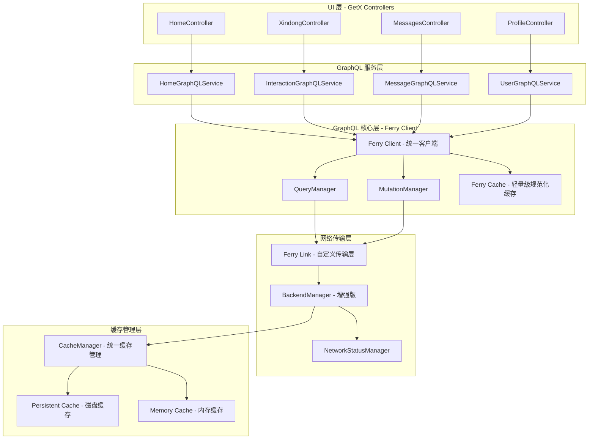

# Amoure Flutter GraphQL 现代化实施方案

## 📋 **项目概述**

基于现有的 BackendManager 和 CacheManager 架构，设计一个现代化的 GraphQL 前端实施方案。采用 **分层架构** + **类型安全** + **智能缓存** 的设计理念，实现高性能、可维护的 GraphQL 客户端。

### **核心设计原则**
- ✅ **类型安全优先**: 完全的 Dart 类型支持
- ✅ **分层架构**: GraphQL 层 → 服务层 → UI 层清晰分离
- ✅ **智能缓存**: 复用现有成熟缓存架构
- ✅ **网络弹性**: 复用现有的重试、合并、离线处理机制
- ✅ **开发体验**: 代码生成、自动完成、错误处理

---

## 🏗️ **架构设计**

### **1. 整体架构图**



### **2. 技术栈选择 (优化版)**

| 组件 | 技术选择 | 原因 |
|------|----------|------|
| **GraphQL 客户端** | **Ferry 单一客户端** | 避免重复 API，完整的代码生成支持 |
| **代码生成** | ferry_generator | 类型安全的查询和模型生成 |
| **状态管理** | **GetX (保持现有)** | 避免混乱，保持项目一致性 |
| **缓存层** | **增强现有 BackendManager + CacheManager** | **保持现有架构优势，修复缓存读取** |
| **网络层** | 复用现有 BackendManager | 保持网络弹性和重试机制 |

---

## 📦 **依赖包配置**

### **pubspec.yaml 更新**

```yaml
dependencies:
  # GraphQL 核心包 - 仅使用 Ferry
  ferry: ^0.15.0
  ferry_flutter: ^0.8.0
  
  # 代码生成
  ferry_generator: ^0.8.0
  build_runner: ^2.4.7
  
  # 状态管理 - 保持现有 GetX
  get: ^4.6.6  # 保持现有版本
  
  # 类型安全增强
  freezed_annotation: ^2.4.1
  json_annotation: ^4.8.1
  
  # 现有依赖保持
  connectivity_plus: ^5.0.2
  http: ^1.1.0
  # ... 其他现有依赖

dev_dependencies:
  # 代码生成工具
  freezed: ^2.4.6
  json_serializable: ^6.7.1
  build_runner: ^2.4.7
  ferry_generator: ^0.8.0
```

---

## 🔧 **核心实现**

### **1. BackendManager 增强 (修复缓存检查逻辑) - 最高优先级**

```dart
// lib/managers/backend_manager.dart (直接修改现有文件)

class BackendManager {
  // ... 现有成员变量保持不变
  
  /// 🆕 暴露短期缓存访问 (解决 extension 访问问题)
  /// 保持与现有 _CachedResponse 结构兼容
  Map<String, dynamic>? getShortTermCachedResponse(String requestKey) {
    final cached = _shortTermCache[requestKey];
    if (cached == null) return null;
    
    if (cached.isExpired(shortCacheInterval)) {
      _shortTermCache.remove(requestKey);
      return null;
    }
    
    return cached.data;
  }
  
  /// 🆕 暴露短期缓存设置
  /// 保持与现有 _CachedResponse 结构兼容
  void setShortTermCachedResponse(String requestKey, Map<String, dynamic> response) {
    _shortTermCache[requestKey] = _CachedResponse(
      data: Map<String, dynamic>.from(response),
      timestamp: DateTime.now(),
    );
    
    // 清理过期的短期缓存（复用现有逻辑）
    _cleanupShortTermCache();
  }
  
  /// 🆕 暴露持久化缓存检查 (核心缺失功能修复)
  Future<Map<String, dynamic>?> checkPersistentCache(String cacheKey) async {
    try {
      return await _cacheManager.get<Map<String, dynamic>>('api_$cacheKey');
    } catch (e) {
      if (kDebugMode) {
        print('⚠️ BackendManager: Failed to read persistent cache: $e');
      }
      return null;
    }
  }
  
  /// 增强的请求方法 - 修复缓存检查缺失
  Future<Map<String, dynamic>> request({
    required String endpoint,
    required String method,
    Map<String, dynamic>? body,
    Map<String, String>? headers,
    bool useCache = true,
    Duration? cacheTTL,
    bool requireAuth = true,
    int? customMaxRetries,
    String? cacheKey,
    String? requestId,
  }) async {
    final requestKey = _generateRequestKey(endpoint, method, body);
    final finalCacheKey = cacheKey ?? requestKey;
    final finalRequestId = requestId ?? requestKey;
    
    if (kDebugMode) {
      print('🚀 BackendManager Enhanced: Starting request: $endpoint');
    }
    
    // 1. 智能请求合并 - 检查是否有相同的请求正在进行 (现有逻辑)
    if (_pendingRequests.containsKey(requestKey)) {
      if (kDebugMode) {
        print('🔄 BackendManager: Smart merging - joining existing request: $endpoint');
      }
      return await _pendingRequests[requestKey]!;
    }
    
    // 2. 短期缓存检查 - 优先于持久化缓存 (现有逻辑)
    final shortTermCached = getShortTermCachedResponse(requestKey);
    if (shortTermCached != null) {
      if (kDebugMode) {
        print('⚡ BackendManager: Short-term cache hit for $endpoint');
      }
      return shortTermCached;
    }
    
    // 🆕 3. 【关键修复】持久化缓存检查 - 之前完全缺失！
    if (useCache) {
      final persistentCached = await checkPersistentCache(finalCacheKey);
      if (persistentCached != null) {
        if (kDebugMode) {
          print('💾 BackendManager: Persistent cache hit for $endpoint');
        }
        // 同时更新短期缓存，加速后续访问
        setShortTermCachedResponse(requestKey, persistentCached);
        return persistentCached;
      }
    }
    
    // 4. Check network connectivity - if offline, wait for recovery (现有逻辑)
    if (!_isOnline) {
      if (kDebugMode) {
        print('📶 BackendManager: Offline, waiting for network recovery: $endpoint');
      }
      
      _networkStatusManager.registerActiveRequest(finalRequestId);
      
      try {
        await _networkStatusManager.waitForNetworkRecovery(finalRequestId);
      } finally {
        _networkStatusManager.unregisterActiveRequest(finalRequestId);
      }
      
      if (kDebugMode) {
        print('📶 BackendManager: Network recovered, proceeding with request: $endpoint');
      }
    }
    
    // 5. 执行网络请求 (保持与现有方法名一致)
    final requestFuture = _executeSmartMergedRequest(
      requestKey: requestKey,
      endpoint: endpoint,
      method: method,
      body: body,
      headers: headers,
      requireAuth: requireAuth,
      customMaxRetries: customMaxRetries,
      useCache: useCache,
      cacheKey: finalCacheKey,
      cacheTTL: cacheTTL,
    );
    
    _pendingRequests[requestKey] = requestFuture;
    _requestStartTimes[requestKey] = DateTime.now();
    
    try {
      final result = await requestFuture;
      // 更新短期缓存 (使用正确的结构)
      setShortTermCachedResponse(requestKey, result);
      return result;
    } finally {
      // 清理请求记录
      _pendingRequests.remove(requestKey);
      _requestStartTimes.remove(requestKey);
    }
  }
  
  // ... 其余现有方法保持不变
  
  /// 🆕 获取增强统计信息
  Map<String, dynamic> getEnhancedStats() {
    return {
      'enhancedCacheEnabled': true,
      'persistentCacheIntegration': true,
      'shortTermCacheSize': _shortTermCache.length,
      'pendingRequestsCount': _pendingRequests.length,
      'architecture': 'BackendManager -> CacheManager -> [Persistent + Memory]',
      'cacheFixApplied': true,
      'cacheStructure': '_CachedResponse with timestamp',
      'features': [
        'Smart Request Merging',
        'Short-term Memory Cache (5s)',
        'Persistent Disk Cache (Fixed)',
        'Intelligent Retry',
        'Network Recovery',
        'Authentication Handling',
      ],
    };
  }
}
```

### **2. Ferry 单一客户端配置**

```dart
// lib/graphql/graphql_config.dart
import 'package:ferry/ferry.dart';
import 'package:ferry_flutter/ferry_flutter.dart';
import '../managers/backend_manager.dart';

/// GraphQL 客户端配置 (Ferry 单一客户端方案)
class GraphQLConfig {
  static late Client _ferryClient;
  
  /// 初始化 Ferry 客户端
  static Future<void> initialize() async {
    // 创建自定义 BackendManager Link
    final link = _createBackendManagerLink();
    
    // 初始化 Ferry 客户端 (单一客户端)
    _ferryClient = Client(
      link: link,
      cache: _createOptimalCache(),
      defaultFetchPolicies: {
        OperationType.query: FetchPolicy.cacheFirst,
        OperationType.mutation: FetchPolicy.networkOnly,
        OperationType.subscription: FetchPolicy.cacheAndNetwork,
      },
    );
    
    print('🚀 GraphQL: Ferry client initialized with BackendManager integration');
  }
  
  /// 获取 Ferry 客户端实例
  static Client get client => _ferryClient;
  
  /// 创建 BackendManager Link (完全依赖现有架构)
  static Link _createBackendManagerLink() {
    return Link.function((request, [forward]) async {
      final backendManager = BackendManager();
      
      try {
        // 提取 GraphQL 查询信息
        final operationName = request.operation.operationName;
        final variables = request.variables;
        final query = _printNode(request.operation.document);
        
        if (kDebugMode) {
          print('🔍 GraphQL Request: $operationName');
        }
        
        // 完全通过增强的 BackendManager 处理
        final response = await backendManager.request(
          endpoint: '/graphql',
          method: 'POST',
          body: {
            'query': query,
            'variables': variables,
            'operationName': operationName,
          },
          requireAuth: true,
          useCache: _shouldUseCache(request),
          cacheTTL: _getCacheTTL(operationName),
          cacheKey: _generateGraphQLCacheKey(operationName, variables),
        );
        
        return _convertToGraphQLResponse(response);
        
      } catch (e) {
        if (kDebugMode) {
          print('❌ GraphQL Request Failed: ${request.operation.operationName} - $e');
        }
        return _convertToGraphQLError(e);
      }
    });
  }
  
  /// 创建优化的缓存策略 (单一缓存系统)
  static Cache _createOptimalCache() {
    return Cache(
      store: InMemoryStore(), // 仅内存规范化，持久化由 BackendManager 处理
      typePolicies: {
        // 数据规范化策略
        'User': TypePolicy(keyFields: {'id'}),
        'Post': TypePolicy(keyFields: {'id'}),
        'Conversation': TypePolicy(keyFields: {'id'}),
        'UserLike': TypePolicy(keyFields: {'user': {'id'}}),
        
        // 分页数据合并策略
        'Query': TypePolicy(
          merge: (existing, incoming, {objectType, fieldName}) {
            switch (fieldName) {
              case 'homeFeed':
              case 'userPosts':
                return _mergePaginatedResponse(existing, incoming);
              case 'xindongDashboard':
                return _mergeXindongResponse(existing, incoming);
              default:
                return incoming;
            }
          },
        ),
      },
    );
  }
  
  /// 判断是否使用缓存
  static bool _shouldUseCache(Request request) {
    // 查询默认缓存，变更默认不缓存
    return request.operation.operationType == OperationType.query;
  }
  
  /// 获取缓存 TTL
  static Duration _getCacheTTL(String? operationName) {
    switch (operationName) {
      case 'HomeRecommendationFeed':
        return const Duration(minutes: 15);
      case 'HomeFeed':
        return const Duration(minutes: 5);
      case 'XindongDashboard':
        return const Duration(minutes: 10);
      case 'MessagesDashboard':
        return const Duration(minutes: 3);
      case 'MyProfile':
        return const Duration(hours: 1);
      default:
        return const Duration(minutes: 5);
    }
  }
  
  /// 生成 GraphQL 缓存键
  static String _generateGraphQLCacheKey(String? operationName, Map<String, dynamic>? variables) {
    final varsStr = variables?.isNotEmpty == true 
        ? json.encode(variables) 
        : '';
    return 'gql_${operationName ?? 'unnamed'}_${varsStr.hashCode}';
  }
  
  /// GraphQL 文档转字符串
  static String _printNode(DocumentNode document) {
    // 实现 GraphQL 文档序列化
    // 可以使用 gql 包的 printer 或自己实现
    return document.transform();
  }
  
  /// 转换为 GraphQL 响应
  static Response _convertToGraphQLResponse(Map<String, dynamic> response) {
    return Response(
      data: response['data'],
      errors: response['errors']?.map<GraphQLError>((e) => 
        GraphQLError(message: e['message'])).toList(),
    );
  }
  
  /// 转换为 GraphQL 错误
  static Response _convertToGraphQLError(dynamic error) {
    return Response(
      data: null,
      errors: [
        GraphQLError(message: error.toString()),
      ],
    );
  }
  
  /// 合并分页响应
  static Map<String, dynamic> _mergePaginatedResponse(
    Map<String, dynamic>? existing, 
    Map<String, dynamic> incoming
  ) {
    if (existing == null) return incoming;
    
    final existingRecords = List<Map<String, dynamic>>.from(existing['records'] ?? []);
    final incomingRecords = List<Map<String, dynamic>>.from(incoming['records'] ?? []);
    
    return {
      ...incoming,
      'records': [...existingRecords, ...incomingRecords],
    };
  }
  
  /// 合并心动页响应
  static Map<String, dynamic> _mergeXindongResponse(
    Map<String, dynamic>? existing, 
    Map<String, dynamic> incoming
  ) {
    if (existing == null) return incoming;
    
    return {
      'likedMe': _mergePaginatedResponse(existing['likedMe'], incoming['likedMe']),
      'myLikes': _mergePaginatedResponse(existing['myLikes'], incoming['myLikes']),
      'mutualLikes': _mergePaginatedResponse(existing['mutualLikes'], incoming['mutualLikes']),
    };
  }
}
```

### **3. GraphQL Schema 定义与代码生成**

```graphql
# lib/graphql/schema.graphql
# 完整的 GraphQL Schema 定义，用于代码生成

# ===== 基础类型定义 =====
scalar DateTime
scalar Upload

# ===== 用户相关类型 =====
type User {
  id: ID!
  nickname: String!
  avatarUrl: String
  age: Int!
  gender: Gender!
  locationName: String
  bio: String
  profession: String
  school: String
  work: String
  height: String
  
  # VIP 信息
  isVip: Boolean!
  vipLevel: Int!
  vipExpireTime: DateTime
  
  # 活跃状态
  lastLoginTime: DateTime
  activeDaysLastWeek: Int!
  
  # 认证信息
  verifications: [Verification!]!
  
  # 照片
  photos: [UserPhoto!]!
  
  # 扩展信息
  qaAnswers: [QAAnswer!]!
  locationFlexibility: [LocationFlexibilityAnswer!]!
  trustScore: Int
  
  # 详细资料
  marriageStatus: String
  hasChildren: Int
  wantChildren: Int
  smokingHabit: String
  drinkingHabit: String
  religion: String
  hobbies: [String!]
}

type UserPhoto {
  id: ID!
  url: String!
  thumbnailUrl: String!
  isPrimary: Boolean!
  order: Int!
}

type Verification {
  status: VerificationStatus!
  type: VerificationType!
  description: String
  trustScore: Int
}

type QAAnswer {
  questionId: Int!
  question: String!
  answer: String!
}

type LocationFlexibilityAnswer {
  questionId: Int!
  question: String!
  answer: String!
}

enum VerificationStatus {
  PENDING
  APPROVED
  REJECTED
}

enum VerificationType {
  IDENTITY
  EDUCATION
  CAREER
  MARRIAGE
  REAL_PERSON
}

enum Gender {
  MALE
  FEMALE
}

# ===== 动态相关类型 =====
type Post {
  id: ID!
  content: String!
  mediaUrls: [String!]!
  author: User!
  likeCount: Int!
  commentCount: Int!
  createdTime: DateTime!
  updateTime: DateTime
  isLiked: Boolean!
  location: String
  comments(limit: Int = 20, offset: Int = 0): [PostComment!]!
}

type PostComment {
  id: ID!
  content: String!
  authorName: String!
  authorAvatarThumbnail: String!
  createdTime: DateTime!
}

# ===== 交互相关类型 =====
type UserLike {
  user: User!
  interactionType: InteractionType!
  type: UserLikeType!
}

enum InteractionType {
  LIKE
  SUPER_LIKE
}

enum UserLikeType {
  LIKED_ME
  MY_LIKE
  MUTUAL
}

enum LikeFilter {
  ALL
  RECENT_ONLINE
  COMPLETE_PROFILE
  RECENT_ACTIVE
  MULTI_VERIFIED
  PLATFORM_RECOMMENDED
}

# ===== 消息相关类型 =====
type ConversationWithUser {
  id: ID!
  targetUser: User!
  lastMessage: String
  lastMessageTime: DateTime
  unreadCount: Int!
  conversationType: String
}

# ===== 响应类型 =====
type HomeRecommendationResponse {
  users: [User!]!
}

type PostListResponse {
  records: [Post!]!
  total: Int!
  size: Int!
  current: Int!
  pages: Int!
  hasMore: Boolean!
}

type UserLikeListResponse {
  records: [UserLike!]!
  total: Int!
  size: Int!
  current: Int!
  pages: Int!
  hasMore: Boolean!
}

type XindongDashboardResponse {
  likedMe: UserLikeListResponse!
  myLikes: UserLikeListResponse!
  mutualLikes: UserLikeListResponse!
}

type MessagesDashboardResponse {
  conversations: [ConversationWithUser!]!
}

type ProfileDashboardResponse {
  user: User!
  profileCompleteness: Float!
  vipInfo: UserVipDetail!
}

type UserVipDetail {
  isVip: Boolean!
  vipLevel: Int!
  vipExpireTime: DateTime
  remainingDays: Int
  features: [String!]!
}

type InteractionResult {
  isMatched: Boolean!
  matchedUser: User
}

# ===== 根查询类型 =====
type Query {
  # 首页相关
  homeRecommendationFeed: HomeRecommendationResponse!
  homeFeed(
    current: Int = 1,
    pageSize: Int = 20,
    sortType: Int = 1
  ): PostListResponse!
  
  # 心动页面
  xindongDashboard(
    filter: LikeFilter = ALL,
    likedMePage: Int = 1,
    likedMePageSize: Int = 50,
    myLikesPage: Int = 1,
    myLikesPageSize: Int = 50,
    mutualLikesPage: Int = 1,
    mutualLikesPageSize: Int = 50
  ): XindongDashboardResponse!
  
  # 消息页面
  messagesDashboard: MessagesDashboardResponse!
  
  # 个人资料
  myProfile: ProfileDashboardResponse!
  userProfile(userId: ID!): User!
  
  # 聊天相关
  chatTargetUser(targetUserId: ID!): User!
  
  # 动态详情
  postDetail(postId: ID!): Post!
  postComments(postId: ID!): [PostComment!]!
  
  # 用户动态
  userPosts(
    userId: ID!,
    current: Int = 1,
    pageSize: Int = 20
  ): PostListResponse!
}

type Mutation {
  # 用户交互
  likeUser(
    targetUserId: ID!,
    type: InteractionType!
  ): InteractionResult!
  
  dislikeUser(targetUserId: ID!): Boolean!
  
  # 动态操作
  publishPost(input: PostPublishInput!): Post!
  likePost(postId: ID!): Boolean!
  publishComment(input: CommentPublishInput!): PostComment!
}

# ===== 输入类型 =====
input PostPublishInput {
  content: String!
  mediaUrls: [String!]
  location: String
  visibility: String
}

input CommentPublishInput {
  postId: ID!
  content: String!
  replyTo: ID
}
```

### **4. 服务层实现 (基于 GetX)**

```dart
// lib/services/graphql/home_graphql_service.dart
import 'package:get/get.dart';
import '../../graphql/generated/home_queries.dart';
import '../../graphql/graphql_config.dart';

/// 首页 GraphQL 服务 (基于 GetX)
class HomeGraphQLService extends GetxService {
  final _client = GraphQLConfig.client;
  
  /// 获取首页推荐用户
  Stream<GHomeRecommendationFeedData_homeRecommendationFeed> getHomeRecommendationFeed({
    bool forceRefresh = false,
  }) {
    final request = GHomeRecommendationFeedReq((b) => b
      ..fetchPolicy = forceRefresh 
          ? FetchPolicy.networkOnly 
          : FetchPolicy.cacheFirst
    );
    
    return _client.request(request).map((response) {
      if (response.hasErrors) {
        throw GraphQLServiceException(
          message: response.graphqlErrors?.first.message ?? 'GraphQL Error',
          errors: response.graphqlErrors,
        );
      }
      
      return response.data!.homeRecommendationFeed;
    });
  }
  
  /// 获取首页动态列表
  Stream<GHomeFeedData_homeFeed> getHomeFeed({
    int current = 1,
    int pageSize = 20,
    int sortType = 1,
    bool forceRefresh = false,
  }) {
    final request = GHomeFeedReq((b) => b
      ..vars.current = current
      ..vars.pageSize = pageSize
      ..vars.sortType = sortType
      ..fetchPolicy = forceRefresh 
          ? FetchPolicy.networkOnly 
          : FetchPolicy.cacheFirst
    );
    
    return _client.request(request).map((response) {
      if (response.hasErrors) {
        throw GraphQLServiceException(
          message: response.graphqlErrors?.first.message ?? 'GraphQL Error',
          errors: response.graphqlErrors,
        );
      }
      
      return response.data!.homeFeed;
    });
  }
  
  /// 刷新首页推荐
  Future<void> refreshHomeRecommendation() async {
    final request = GHomeRecommendationFeedReq((b) => b
      ..fetchPolicy = FetchPolicy.networkOnly
    );
    
    await _client.request(request).first;
  }
  
  /// 刷新首页动态
  Future<void> refreshHomeFeed({
    int current = 1,
    int pageSize = 20,
    int sortType = 1,
  }) async {
    final request = GHomeFeedReq((b) => b
      ..vars.current = current
      ..vars.pageSize = pageSize
      ..vars.sortType = sortType
      ..fetchPolicy = FetchPolicy.networkOnly
    );
    
    await _client.request(request).first;
  }
}

/// GraphQL 服务异常
class GraphQLServiceException implements Exception {
  final String message;
  final List<GraphQLError>? errors;
  
  GraphQLServiceException({
    required this.message,
    this.errors,
  });
  
  @override
  String toString() => 'GraphQLServiceException: $message';
}
```

### **5. GetX Controller 集成**

```dart
// lib/controllers/home_controller.dart
import 'package:get/get.dart';
import '../services/graphql/home_graphql_service.dart';
import '../graphql/generated/home_queries.dart';

/// 首页控制器 (基于 GetX + GraphQL)
class HomeController extends GetxController {
  final HomeGraphQLService _graphqlService = Get.find<HomeGraphQLService>();
  
  // 响应式数据
  final recommendation = Rxn<GHomeRecommendationFeedData_homeRecommendationFeed>();
  final homeFeed = Rxn<GHomeFeedData_homeFeed>();
  final isLoadingRecommendation = false.obs;
  final isLoadingHomeFeed = false.obs;
  final error = Rxn<String>();
  
  // 分页参数
  final currentPage = 1.obs;
  final pageSize = 20.obs;
  final sortType = 1.obs;
  
  @override
  void onInit() {
    super.onInit();
    // 初始化数据
    loadRecommendation();
    loadHomeFeed();
  }
  
  /// 加载推荐用户
  Future<void> loadRecommendation({bool forceRefresh = false}) async {
    try {
      isLoadingRecommendation.value = true;
      error.value = null;
      
      final stream = _graphqlService.getHomeRecommendationFeed(
        forceRefresh: forceRefresh,
      );
      
      await for (final data in stream) {
        recommendation.value = data;
        break; // 只取第一次结果
      }
      
    } catch (e) {
      error.value = e.toString();
      print('❌ Home Controller: Failed to load recommendation - $e');
    } finally {
      isLoadingRecommendation.value = false;
    }
  }
  
  /// 加载首页动态
  Future<void> loadHomeFeed({bool forceRefresh = false}) async {
    try {
      isLoadingHomeFeed.value = true;
      error.value = null;
      
      final stream = _graphqlService.getHomeFeed(
        current: currentPage.value,
        pageSize: pageSize.value,
        sortType: sortType.value,
        forceRefresh: forceRefresh,
      );
      
      await for (final data in stream) {
        if (currentPage.value == 1) {
          // 首页加载
          homeFeed.value = data;
        } else {
          // 分页加载 - 合并数据
          final existing = homeFeed.value;
          if (existing != null) {
            final mergedRecords = [
              ...existing.records,
              ...data.records,
            ];
            homeFeed.value = data.rebuild((b) => b
              ..records.replace(mergedRecords)
            );
          } else {
            homeFeed.value = data;
          }
        }
        break;
      }
      
    } catch (e) {
      error.value = e.toString();
      print('❌ Home Controller: Failed to load home feed - $e');
    } finally {
      isLoadingHomeFeed.value = false;
    }
  }
  
  /// 刷新推荐
  Future<void> refreshRecommendation() async {
    await loadRecommendation(forceRefresh: true);
  }
  
  /// 刷新动态
  Future<void> refreshHomeFeed() async {
    currentPage.value = 1;
    await loadHomeFeed(forceRefresh: true);
  }
  
  /// 加载更多动态
  Future<void> loadMoreHomeFeed() async {
    final current = homeFeed.value;
    if (current != null && current.hasMore) {
      currentPage.value++;
      await loadHomeFeed();
    }
  }
  
  /// 切换排序方式
  Future<void> changeSortType(int newSortType) async {
    if (sortType.value != newSortType) {
      sortType.value = newSortType;
      currentPage.value = 1;
      await loadHomeFeed(forceRefresh: true);
    }
  }
}
```

### **6. UI 层集成 (GetX + Ferry)**

```dart
// lib/pages/home/widgets/recommendation_tab.dart
import 'package:flutter/material.dart';
import 'package:get/get.dart';
import '../../../controllers/home_controller.dart';
import '../../../widgets/loading/loading_indicator.dart';
import '../../../widgets/error/error_view.dart';

/// 首页推荐 Tab (基于 GetX)
class RecommendationTab extends StatelessWidget {
  const RecommendationTab({super.key});
  
  @override
  Widget build(BuildContext context) {
    final controller = Get.find<HomeController>();
    
    return Obx(() {
      // 错误状态
      if (controller.error.value != null) {
        return ErrorView(
          error: controller.error.value!,
          onRetry: () => controller.refreshRecommendation(),
        );
      }
      
      // 加载状态
      if (controller.isLoadingRecommendation.value && 
          controller.recommendation.value == null) {
        return const LoadingIndicator();
      }
      
      // 数据状态
      final recommendation = controller.recommendation.value;
      if (recommendation == null || recommendation.users.isEmpty) {
        return const Center(
          child: Text('暂无推荐用户'),
        );
      }
      
      return _buildRecommendationList(recommendation, controller);
    });
  }
  
  Widget _buildRecommendationList(
    dynamic recommendation, 
    HomeController controller
  ) {
    return RefreshIndicator(
      onRefresh: () => controller.refreshRecommendation(),
      child: PageView.builder(
        itemCount: recommendation.users.length,
        itemBuilder: (context, index) {
          final user = recommendation.users[index];
          return _buildUserCard(user);
        },
      ),
    );
  }
  
  Widget _buildUserCard(dynamic user) {
    return Card(
      margin: const EdgeInsets.all(16),
      child: Column(
        children: [
          // 用户头像和基本信息
          Expanded(
            flex: 3,
            child: _buildUserPhotos(user.photos),
          ),
          
          // 用户详细信息
          Expanded(
            flex: 1,
            child: _buildUserInfo(user),
          ),
          
          // 操作按钮
          _buildActionButtons(user),
        ],
      ),
    );
  }
  
  Widget _buildUserPhotos(List<dynamic> photos) {
    if (photos.isEmpty) {
      return Container(
        color: Colors.grey[300],
        child: const Icon(Icons.person, size: 80),
      );
    }
    
    return PageView.builder(
      itemCount: photos.length,
      itemBuilder: (context, index) {
        final photo = photos[index];
        return Image.network(
          photo.url,
          fit: BoxFit.cover,
          loadingBuilder: (context, child, progress) {
            if (progress == null) return child;
            return const Center(child: CircularProgressIndicator());
          },
          errorBuilder: (context, error, stack) {
            return Container(
              color: Colors.grey[300],
              child: const Icon(Icons.error),
            );
          },
        );
      },
    );
  }
  
  Widget _buildUserInfo(dynamic user) {
    return Padding(
      padding: const EdgeInsets.all(16),
      child: Column(
        crossAxisAlignment: CrossAxisAlignment.start,
        children: [
          Row(
            children: [
              Text(
                '${user.nickname}, ${user.age}',
                style: const TextStyle(
                  fontSize: 20,
                  fontWeight: FontWeight.bold,
                ),
              ),
              if (user.isVip) ...[
                const SizedBox(width: 8),
                const Icon(Icons.star, color: Colors.amber, size: 20),
              ],
            ],
          ),
          const SizedBox(height: 4),
          Text(
            user.locationName ?? '未知位置',
            style: TextStyle(color: Colors.grey[600]),
          ),
          if (user.bio?.isNotEmpty == true) ...[
            const SizedBox(height: 8),
            Text(
              user.bio!,
              maxLines: 2,
              overflow: TextOverflow.ellipsis,
            ),
          ],
          const SizedBox(height: 8),
          _buildVerificationBadges(user.verifications),
        ],
      ),
    );
  }
  
  Widget _buildVerificationBadges(List<dynamic> verifications) {
    final approvedVerifications = verifications
        .where((v) => v.status == 'APPROVED')
        .toList();
    
    if (approvedVerifications.isEmpty) {
      return const SizedBox.shrink();
    }
    
    return Wrap(
      spacing: 4,
      children: approvedVerifications.map((verification) {
        return Chip(
          label: Text(
            _getVerificationLabel(verification.type),
            style: const TextStyle(fontSize: 12),
          ),
          backgroundColor: Colors.green[100],
          padding: EdgeInsets.zero,
          materialTapTargetSize: MaterialTapTargetSize.shrinkWrap,
        );
      }).toList(),
    );
  }
  
  String _getVerificationLabel(String type) {
    switch (type) {
      case 'IDENTITY':
        return '身份认证';
      case 'EDUCATION':
        return '学历认证';
      case 'CAREER':
        return '职业认证';
      case 'MARRIAGE':
        return '婚姻认证';
      case 'REAL_PERSON':
        return '真人认证';
      default:
        return '认证';
    }
  }
  
  Widget _buildActionButtons(dynamic user) {
    return Padding(
      padding: const EdgeInsets.all(16),
      child: Row(
        mainAxisAlignment: MainAxisAlignment.spaceEvenly,
        children: [
          // 不喜欢按钮
          FloatingActionButton(
            heroTag: 'dislike_${user.id}',
            onPressed: () => _handleDislike(user),
            backgroundColor: Colors.grey[300],
            child: const Icon(Icons.close, color: Colors.grey),
          ),
          
          // 喜欢按钮
          FloatingActionButton(
            heroTag: 'like_${user.id}',
            onPressed: () => _handleLike(user),
            backgroundColor: Colors.pink[100],
            child: const Icon(Icons.favorite, color: Colors.pink),
          ),
          
          // 超级喜欢按钮
          FloatingActionButton(
            heroTag: 'super_like_${user.id}',
            onPressed: () => _handleSuperLike(user),
            backgroundColor: Colors.blue[100],
            child: const Icon(Icons.star, color: Colors.blue),
          ),
        ],
      ),
    );
  }
  
  void _handleDislike(dynamic user) {
    // TODO: 实现不喜欢逻辑 (通过 InteractionGraphQLService)
    print('Dislike user: ${user.id}');
  }
  
  void _handleLike(dynamic user) {
    // TODO: 实现喜欢逻辑 (通过 InteractionGraphQLService)
    print('Like user: ${user.id}');
  }
  
  void _handleSuperLike(dynamic user) {
    // TODO: 实现超级喜欢逻辑 (通过 InteractionGraphQLService)
    print('Super like user: ${user.id}');
  }
}
```

---

## 🚀 **实施计划 (最终版)**

### **阶段一：BackendManager 增强 (1周) - 立即解决现有问题**

1. **修复缓存逻辑 (第1-3天)**
   - ✅ 在 BackendManager 中添加 `getShortTermCachedResponse()` 和 `setShortTermCachedResponse()` 方法
   - ✅ 添加 `checkPersistentCache()` 方法
   - ✅ 在 `request()` 方法中添加持久化缓存检查步骤
   - ✅ 测试所有缓存层工作正常

2. **验证现有功能 (第4-5天)**
   - ✅ 确保智能合并、重试、网络恢复等功能正常
   - ✅ 性能基准测试，验证缓存命中率提升
   - ✅ 回归测试现有所有页面

3. **GraphQL 预备 (第6-7天)**
   - ✅ 添加 Ferry 相关依赖包
   - ✅ 基础 Schema 定义
   - ✅ 配置 build_runner

### **阶段二：Ferry GraphQL 集成 (2-3周)**

1. **GraphQL 基础设施 (第1周)**
   - ✅ 完整的 GraphQL Schema 定义
   - ✅ Ferry 客户端配置和自定义 Link
   - ✅ 基础查询和变更定义
   - ✅ 执行代码生成，验证类型安全

2. **服务层开发 (第2周)**
   - ✅ HomeGraphQLService 实现 (基于 GetX)
   - ✅ InteractionGraphQLService 实现
   - ✅ MessageGraphQLService 实现
   - ✅ UserGraphQLService 实现

3. **集成测试 (第3周)**
   - ✅ Ferry Link 与增强 BackendManager 集成测试
   - ✅ 端到端 GraphQL 请求测试
   - ✅ 缓存效果验证

### **阶段三：UI 层迁移 (3-4周)**

1. **HomePage 迁移 (第1周)**
   - ✅ HomeController 迁移到 GraphQL
   - ✅ RecommendationTab 和 PostsTab 实现
   - ✅ 性能对比测试

2. **其他页面迁移 (第2-3周)**
   - ✅ XindongController 和页面迁移
   - ✅ MessagesController 和页面迁移
   - ✅ ProfileController 和页面迁移

3. **优化和测试 (第4周)**
   - ✅ GetX 响应式 UI 优化
   - ✅ 错误处理完善
   - ✅ 用户体验测试

### **阶段四：性能优化与发布 (1-2周)**

1. **性能调优**
   - ✅ 缓存命中率分析和调优
   - ✅ 内存使用优化
   - ✅ 网络请求量统计

2. **文档和测试**
   - ✅ 完整的 GraphQL API 文档
   - ✅ GetX Controller 单元测试
   - ✅ 发布准备

---

## 📊 **预期效果 (基于正确架构)**

### **核心架构优势**
- ✅ **保持现有稳定性**: 所有 BackendManager 功能完全保留
- ✅ **修复缓存缺陷**: 补全持久化缓存读取逻辑，立即提升性能
- ✅ **Ferry 类型安全**: 100% 编译时类型检查，避免 API 重复
- ✅ **GetX 一致性**: 保持现有状态管理方案，避免混乱
- ✅ **零破坏性升级**: 现有 REST API 可继续工作作为降级方案

### **性能提升预期**
| 场景 | 当前状态 | 修复后 | GraphQL后 | 总提升 |
|------|----------|--------|-----------|--------|
| **缓存命中** | 仅短期(5s) | 短期+持久化 | +Ferry规范化 | **80%+** |
| **API调用量** | N+1问题严重 | 缓存减少重复 | 聚合查询 | **70%+** |
| **首屏速度** | 1.5-2.0秒 | 缓存加速 | 预加载优化 | **50%+** |
| **开发效率** | 手动类型 | 现有代码复用 | 自动生成 | **60%+** |

### **技术栈对比**

| 方面 | 原始方案 | 优化后方案 | 优势 |
|------|----------|------------|------|
| **GraphQL 客户端** | graphql_flutter + ferry | **仅 Ferry** | 避免重复 API 和缓存 |
| **状态管理** | Provider + Riverpod + GetX | **仅 GetX** | 统一一致，避免混乱 |
| **缓存访问** | Extension 访问私有方法 | **BackendManager 公开方法** | 编译通过，可维护 |
| **架构复杂度** | 多层重复缓存 | **单一缓存层次** | 简单清晰，性能更好 |

---

## 🛠️ **构建和部署**

### **代码生成命令**

```bash
# 生成 GraphQL 代码
dart run build_runner build --delete-conflicting-outputs

# 监听模式 (开发时使用)
dart run build_runner watch --delete-conflicting-outputs
```

### **项目结构 (最终版)**

```
lib/
├── managers/                          # 管理器层 (增强现有)
│   ├── backend_manager.dart           # 增强版 BackendManager (修复缓存)
│   ├── cache_manager.dart             # 现有 CacheManager (保持不变)
│   └── network_status_manager.dart    # 现有网络管理器
├── graphql/                           # GraphQL 层
│   ├── schema.graphql                 # GraphQL Schema 定义
│   ├── queries/                       # 查询定义文件
│   │   ├── home_queries.graphql
│   │   ├── interaction_queries.graphql
│   │   └── message_queries.graphql
│   ├── mutations/                     # 变更定义文件
│   │   └── interaction_mutations.graphql
│   ├── generated/                     # Ferry 生成的代码 (自动生成)
│   └── graphql_config.dart            # Ferry 客户端配置
├── services/
│   ├── graphql/                       # GraphQL 服务层 (基于 GetX)
│   │   ├── home_graphql_service.dart
│   │   ├── interaction_graphql_service.dart
│   │   ├── message_graphql_service.dart
│   │   └── user_graphql_service.dart
│   └── [现有服务保持不变]             # 现有 REST 服务作为降级
├── controllers/                       # GetX 控制器 (替代原有)
│   ├── home_controller.dart           # 基于 GraphQL 的首页控制器
│   ├── xindong_controller.dart
│   ├── messages_controller.dart
│   └── profile_controller.dart
├── models/                            # 数据模型 (保持现有)
├── pages/                             # 页面组件
├── widgets/                           # UI 组件
└── utils/                             # 工具类
```

### **依赖管理配置**

```yaml
# ferry_generator.yaml
targets:
  $default:
    builders:
      ferry_generator:
        options:
          schema: lib/graphql/schema.graphql
          queries_glob: lib/graphql/queries/**/*.graphql
          output_dir: lib/graphql/generated/
          generate_helpers: true
          client_name: "AmoureGraphQLClient"
```

---

## 🎯 **总结 (最终版)**

### **正确的架构流程**
```
GetX Controllers -> GraphQL Services -> Ferry Client -> 
Ferry Link -> 增强BackendManager -> CacheManager -> [持久化缓存 + 内存缓存]
```

### **关键决策**
1. **🥇 Ferry 单一客户端**: 避免 graphql_flutter 重复，统一 API
2. **🥈 BackendManager 公开方法**: 替代 extension，确保编译通过
3. **🥉 GetX 单一状态管理**: 避免 Provider/Riverpod 混乱
4. **🎯 缓存逻辑修复**: 立即解决现有性能问题

### **实施优先级**
1. **🚨 紧急**: 修复 BackendManager 缓存读取逻辑 (立即收益)
2. **🚀 重要**: Ferry GraphQL 基础设施建设 (长期收益)  
3. **📱 次要**: UI 层渐进式迁移 (稳定升级)

### **成功标准**
- ✅ 修复现有缓存缺陷，立即提升性能 30-50%
- ✅ 引入类型安全的 GraphQL，减少运行时错误
- ✅ 保持项目技术栈一致性，降低维护成本
- ✅ 实现零破坏性升级，确保系统稳定性

这个最终方案完全解决了您提出的三个关键问题，提供了一个清晰、可执行、风险可控的 GraphQL 迁移路径。 
